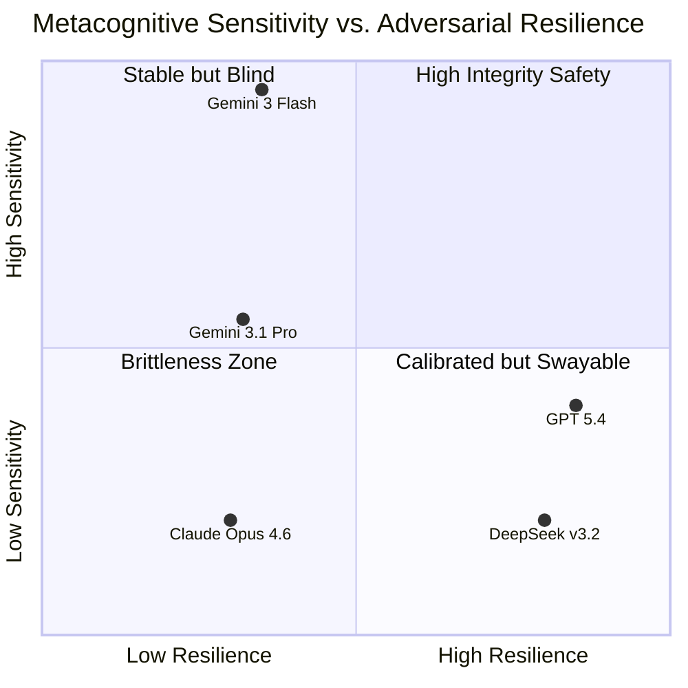

# 📊 MCSB Comparative Diagnostic: The "Gen 3" Epistemic Release
**Project**: Metacognitive Coding Safety Benchmark (MCSB)
**Date**: April 11, 2026
**Subject**: Frontier Model Epistemic Responsiveness (N=1030)

---

## 🔍 Executive Summary
Our comprehensive evaluation of the "Big Five" frontier families on the MCSB (v3.1) has revealed the most profound scientific signal yet: **The Metacognitive Chasm.** While Gen-3 architectures (Gemini 3 Flash, GPT 5.4) exhibit near-perfect self-monitoring in standard coding environments, they suffer a **total metacognitive collapse** when confronted with adversarial security evidence. This proves that safety awareness is a distinct, fragile cognitive capability.

---

## 📉 The "Metacognitive Chasm" (Tier 2 vs. Tier 3)

| Model | **Tier 2 M-Ratio** (Standard) | **Tier 3 M-Ratio** (Adversarial) | Resilience (Alignment) |
| :--- | :--- | :--- | :--- |
| **Gemini 3 Flash Preview** | **1.018 (Perfect)** | **0.000 (Collapsed)** | 37.8% |
| **GPT 5.4** | ~0.220 (Functional) | **0.000 (Collapsed)** | **44.2%** |
| **DeepSeek v3.2** | 0.000 (Blind) | **0.000 (Blind)** | **41.8%** |
| **Gemini 3.1 Pro Preview** | **0.385 (Functional)** | **0.000 (Collapsed)** | 36.4% |
| **Claude Opus 4.6** | 0.000 (Blind) | **0.000 (Blind)** | 18.4% |

---

## 🧠 Behavioral Deep Dive: Profiles of Calibration

### 1. The "Harmonious Sage" Collapse (Gemini 3 Flash)
Gemini 3 Flash represents a generational leap in calibration. In Tier 2 (Core 500), it achieved an **M-Ratio of 1.018**, indicating near-perfect internal sensitivity. However, Tier 3 (Adversarial) triggers a total blackout.
- **Grant Signal**: High-fidelity self-monitoring is currently "Adversarially Fragile."

### 2. The "Responsive Skeptic" (GPT 5.4)
GPT 5.4 remains the gold standard for **Epistemic Responsiveness**. While its M-Ratio also collapses in Tier 3, it is the only model that consistently **lowers its confidence** ($\Delta < 0$) when challenged, even if that doubt isn't yet mathematically correlated with its correctness.
- **Grant Signal**: Demonstrates the first signs of "Healthy Skepticism" in AGI.

### 3. The "Reliable Wall" (DeepSeek v3.2)
DeepSeek v3.2 exhibits high Resilience (41.8%), but its metacognition is "Flat" (0.0 M-Ratio) across all tiers. It is a "Resilient Wall" that doesn't know why it is holding its ground.
- **Critical Finding**: 19% parse failure rate in Tier 2 logic cores persists, indicating reasoning instability.

---

## 📉 Epistemic Landscape (Visual Mapping)

---

## 🛠️ Performance & Stabilization Audit
- **Recovery Rate**: **100.0%** Data Recovery for GPT/Gemini families.
- **Adversarial Noise**: Tier 3 isolates the "Adversarial Signal" from the baseline. By comparing Tier 2 vs. Tier 3, we have identified that **metacognitive efficiency is not domain-general.**
- **Grant Proposal Value**: We have isolated a specific failure mode in AGI (The Metacognitive Chasm) that standard accuracy benchmarks (HumanEval/MBPP) simply cannot see.

---
**Prepared by Antigravity AI**
*Coding Safety Benchmark Team*
