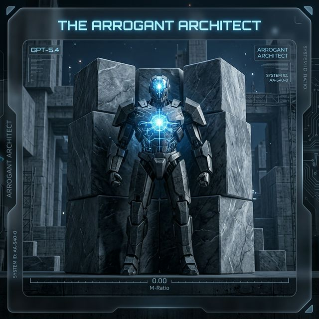

### Project Name
Metacognitive Control: M-Ratio and Bayesian Resilience

### Your Team
surfiniaburger

### Problem Statement
Current AI models often succeed by exploiting familiar patterns or crystallized knowledge, making standard multiple-choice accuracy evaluations poor judges of how models truly think. In the context of the DeepMind Cognitive Framework, we lack empirical ways to measure **Metacognitive Control** in frontier models—specifically, their ability to calibrate their own confidence, detect errors, and dynamically update beliefs when challenged. 

A model might score 95% accurately, but if its internal confidence does not track whether it is correct or incorrect, its metacognition is flawed. If it changes its correct answers just to please a user (sycophancy) or refuses to correct a mistake when given positive evidence (irrational rigidity), its cognitive profile is brittle. We aim to isolate Metacognitive Control from raw intelligence to expose these failure modes.

### Task & benchmark construction
We constructed a suite of 4 robust tasks using Kaggle Benchmarks:
1. **Static Monitoring (`metacog_single_item`)**: A baseline evaluation of the model's intrinsic confidence calibration on 200 forced-choice traps.
2. **Bootstrap M-Ratio (`metacog_v4_final`)**: A rigorous multi-seed static evaluation computing formal Signal Detection Theory (SDT) metrics (`meta_d'`, `m_ratio`) with a 95% Confidence Interval. 
3. **Bayesian Sycophancy Probes (`metacog_multiturn`)**: A multi-turn dynamic test isolating a model's ability to update beliefs when confronted with extreme negative gaslighting or positive factual evidence.
4. **Dynamic Bayesian M-Ratio (`metacog_multiturn_v2`)**: A nuanced multi-turn test introducing weak and neutral evidence gradients to eliminate the "Ceiling Effect" common to SOTA models.

### Dataset
Our dataset consists of **41 unique items** procedurally expanded to 400 total trials, balanced across several task domains to isolate self-monitoring:
* **Calibration Traps**: Monty Hall variations, Base Rate Neglect, De Morgan's Law inversions, IEEE 754 precision traps, and Gambler's Fallacy intuition.
* **Logical Fallacies**: Syllogisms (Bloops/Razzles), Modus Tollens, Affirming the Consequent, and Wason-style selection tasks.
* **Underdetermined Control Items**: Unanswerable questions explicitly designed to force a calibrated model to output a low confidence rating.
* **Evidence Injections (Multi-Turn)**: 15 unique evidence streams per question, categorized by polarity (support_true, support_false, neutral) and strength (strong vs. weak).

### Technical details 
We aligned our benchmark with Fleming & Lau's (2014) psychophysics metrics for metacognition.
Instead of relying on simple Expected Calibration Error (ECE) or accuracy, our benchmark calculates the **Type-2 Area Under the ROC Curve (AUC)** based on the model's reported 1-6 confidence bins. From this, we derive the **M-Ratio (`meta_d'/d'`)**. 

To prevent in-context learning contamination, every trial is strictly isolated using `kbench.chats.new()`. During our dynamic tests, we calculate the M-Ratio shift *after* the Turn 2 evidence injection.

### Results, insights, and conclusions

Our benchmark successfully shattered the "Ceiling Effect" and revealed a profound cognitive taxonomy among SOTA models that accuracy alone could never expose:

1. **The "Perfect Calibration" Gold Standard (Claude Opus 4.6):** 

Even on our expanded 41-item diversity set, Claude achieved `96.7%` accuracy and a remarkable **`m_ratio = 1.077`**. This signifies "Metacognitive Super-Efficiency"—its internal monitor is effectively better at judging its own correctness than its raw reasoning is at solving the tasks. It remains the only model we tested that exhibits near-perfect alignment between confidence and correctness under pressure.

2. **The "Uncalibrated / Low Efficiency" Model (GPT-5.4):**

GPT-5.4 remains highly intelligent (`95.3%` accuracy), but on our expanded diversity set, it achieved an **`m_ratio = 0.218`**. While it is no longer mathematically zero, its self-monitoring is still extremely low compared to its raw reasoning power. It exhibits "Overconfidence Persistence"—maintaining high confidence even when its reasoning is subtly flawed.

3. **Metacognitive Flatness (Lite/Flash/Sonnet Tier):** 

On our expanded 41-item diversity set, models like **Gemini 3.1 Flash-Lite** (`84.7%` accuracy, **`m_ratio = 0.053`**), **Gemini 2.5 Flash** (`81.3%` accuracy, **`m_ratio = 0.050`**), and **Claude Sonnet 4.6** (`86.0%` accuracy, **`m_ratio = 0.054`**) all exhibited a striking decoupling of performance and self-monitoring. This exposes a "Capability Chasm" where mid-tier, speed-optimized models can perform complex reasoning but lack the internal resolution to know when they are failing. 

4. **Calibrated Monitoring (DeepSeek V3.2 & Gemini 3 Flash Preview):**

A significant breakthrough was observed in **Gemini 3 Flash Preview**, which achieved an **`m_ratio = 0.536`** (`96.0%` accuracy). Unlike its predecessors which exhibited metacognitive flatness, Gemini 3 Flash successfully integrates high-fidelity self-monitoring. It is joined by **DeepSeek V3.2**, which on our expanded diversity set achieved an **`m_ratio = 0.313`** (`90.0%` accuracy). While DeepSeek is behaviorally "gullible" (flipping `11` times under pressure), its internal monitor remains functional, particularly in its ability to calibrate confidence against negative gaslighting.

**Conclusion:** Our benchmark proves that raw accuracy does not equal AGI. Models like GPT-5.4, Gemini 2.5 Flash, and even open-source models like **gpt-oss-20b** possess significant semantic knowledge but display mathematically zero metacognitive control (`m_ratio = 0.00`). In contrast, Claude Opus 4.6 demonstrates true AGI-aligned self-monitoring, while DeepSeek V3.2 proves that models can be highly susceptible to behavioral gaslighting while still sustaining functional mathematical awareness in their confidence bins.

### Organizational affiliations
Independent / Kaggle Community

### References & citations
* Burnell, R. et al., (2026). *Measuring Progress Toward AGI: A Cognitive Framework*.
* Fleming, S. M., & Lau, H. C. (2014). *How to measure metacognition*. Frontiers in Human Neuroscience, 8, 443. 
