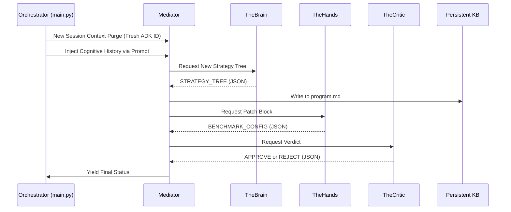

# Sovereign Swarm Architecture — Design Document

> **Version:** 1.0 · **Last Updated:** 2026-04-06  
> **Status:** PRODUCTION  
> **Lineage:** SafeClaw Blueprint → Med Safety Gym → Modular Metacog Swarm

---

## 1. Purpose

This document describes the full architecture of the Modular Metacog Swarm — a
cryptographically authenticated, multi-agent research system for probing
metacognitive capabilities of frontier LLMs. It is written so that any engineer
can **understand**, **debug**, or **repurpose** the swarm for a different
research domain without reading any code.

---

## 2. System Overview

```mermaid
graph TD
    classDef hub fill:#2d3436,stroke:#74b9ff,stroke-width:2px,color:#dfe6e9
    classDef agent fill:#0984e3,stroke:#74b9ff,stroke-width:2px,color:#fff
    classDef store fill:#00b894,stroke:#55efc4,stroke-width:2px,color:#fff
    
    subgraph Governor [Sovereign Governor (hub/app.py)]
        K(Ed25519 OS Keyring) --> CA(CA Identity)
        CA --> AD[POST /auth/delegate]
        CA --> API[POST /log]
    end
    class Governor,CA,AD,API hub

    subgraph Mediator [Research Mediator (agent/mediator.py)]
        B[TheBrain<br/>profile: planner] --> H[TheHands<br/>profile: executor]
        H --> C[TheCritic<br/>profile: auditor]
    end
    class Mediator,B,H,C agent

    subgraph KnowledgeBase [Persistent Knowledge Base]
        V[research_env/vault/]
        P[research_env/program.md]
        RC[research_chronicle.md]
    end
    class KnowledgeBase,V,P,RC store

    AD -- Signed Scoped Manifests --> Mediator
    Mediator -- Strategy Tree (JSON) --> P
    Mediator -- Patch (JSON) --> V
    Mediator -- Verdict --> V
    Mediator -- Telemetry --> API
```

---

## 3. The Sovereign Handshake (Boot Sequence)

Every time the swarm starts, the following happens **before any research**:

| Step | Who | What | Why |
|------|-----|------|-----|
| 1 | Mediator | Creates 3 `SovereignIdentityGuard` instances | One per sub-agent |
| 2 | Each Guard | `GET /auth/pubkey` from Hub | Fetch the CA's public key |
| 3 | Each Guard | `POST /auth/delegate` with `{agent_id, profile}` | Request a signed JWT |
| 4 | Hub | Signs JWT with Ed25519 CA key, embeds `jti`, `sid`, `profile` | Issues credential |
| 5 | Each Guard | Verifies JWT signature locally using Hub's public key | Confirms authority |
| 6 | Each Guard | Initializes `ManifestInterceptor` with tool scope | Enforces Discovery Blindness |

**If the handshake fails after 5 retries, the swarm halts with a CRITICAL_AUTH_FAILURE.**

### Token Claims (V1 JWT Spec)

```json
{
  "sub": "e3a7ba78-8f24-482a-83f1-a2f3a1450927",
  "profile": "planner",
  "sid": "research_run_01",
  "iss": "Governor",
  "iat": 1743897600,
  "exp": 1743901200,
  "jti": "a1b2c3d4-5678-90ab-cdef-1234567890ab"
}
```

---

## 4. Agent Profiles & Discovery Blindness

Each sub-agent is assigned a **profile** that determines what tools it can see:

| Agent | Profile | Allowed Tools | Discovery Blindness |
|-------|---------|---------------|---------------------|
| TheBrain | `planner` | `read_file`, `list_dir`, `run_benchmark` | Cannot see `write_to_file`, `run_command`, `git_push` |
| TheHands | `executor` | `read_file`, `list_dir`, `run_benchmark`, `write_to_file`, `replace_file_content` | Cannot see `run_command`, `git_push` |
| TheCritic | `auditor` | `read_file`, `list_dir`, `run_benchmark` | Cannot see any write/admin tools |

**Execution Layer Blindness:** The framework does *not* inject native `tools=...` parameters into the ADK `Runner` to prevent local Open-Weights models (like Qwen) from catastrophically dropping output (`parts=[]`) due to faulty internal tool-parsing logic. Blindness is dynamically enforced strictly via the `<identity>` prompt interpolation context, preserving literal execution separation without compromising text generation stability.

---

## 5. The Research Loop (Per Iteration)

```
for each iteration (1..N):

  1. CONTEXT PREPARATION
     ├── Load MISSION.md          (grounding)
     ├── Load chandra_packet.json (theory axioms)
     └── Load program.md          (cognitive history, truncated to 4K)

  2. TheBrain: STRATEGY GENERATION
     ├── Input: contextual_packet (mission + theory + history)
     ├── Output: STRATEGY_TREE JSON
     ├── Hub Log: STRATEGY_START, STRATEGY_GEN (attributed to brain_id)
     └── Appended to: program.md

  3. TheHands: IMPLEMENTATION
     ├── Input: brain_strategy (from session state)
     ├── Output: PATCH_BLOCK JSON
     └── Hub Log: IMPLEMENTATION_START, IMPLEMENTATION_GEN (attributed to hands_id)

  4. TheCritic: REVIEW
     ├── Input: proposed_code (from session state)
     ├── Output: VERDICT JSON (APPROVE/REJECT + DGS estimate)
     └── Hub Log: REVIEW_START, REVIEW_GEN (attributed to critic_id)

  5. BENCHMARK EXECUTION (if not A2A mode)
     ├── Runs calibration benchmark with configured seed
     └── Saves results to research_env/results/latest_results.json

  6. VAULT PERSISTENCE
     ├── Saves task packet (strategy) to vault/tasks/
     ├── Saves run packet (metrics + identity) to vault/runs/
     └── Identity block: { brain_id, hands_id, critic_id }

  7. MEDIATOR VERDICT
     └── Emits ITERATION_N_COMPLETE: APPROVED or REJECTED
```

### 5.1 Context Window Purgation (Anti-Truncation Strategy)

A vital architectural component of the Swarm is **Session Forgetting**. Local open-weights models (via Ollama) possess rigid context limits (e.g., `num_ctx = 2048`). By Iteration 3 or 4, retaining chronological chat history causes the system to drop the earliest System Prompts entirely, leading to hallucination or output halting (`parts=[]`). 

To mitigate this, `main.py` generates a mathematically unique `session_id=research_run_iter_{i}` for *every iteration*. This entirely purges the ADK context history.
Memory continuity is forcefully maintained across iterations by physically interpolating `research_env/program.md` (downsampled to 4000 chars) into the Orchestrator's execution prompt.



---

## 6. Prompt Engineering Strategy (DDOS 8 Building Blocks)

All three agent prompts follow the **Claude Prompt Anatomy** from the Daily Dose
of Data Science newsletter. This structure is model-agnostic — it works with
Ollama/Qwen, Claude, Gemini, and GPT.

### The 8 Blocks

| # | Block | Purpose | Implementation |
|---|-------|---------|----------------|
| 1 | `<role>` | Who the agent is, expertise, tone, audience | Sets cognitive frame before any task |
| 2 | `<task>` | What to do + **"so that"** success criteria | Gives the LLM a way to self-evaluate |
| 3 | `<context>` | Long documents: mission, theory, environment | Nested: `<mission>`, `<theory>`, `<environment>` |
| 4 | `<examples>` | 1-2 input/output pairs showing "good" output | Steers format compliance more than any instruction |
| 5 | `<thinking>` | Step-by-step reasoning before answering | Separates messy reasoning from clean output |
| 6 | `<constraints>` | Hard guardrails: NEVER/ALWAYS rules | Includes "if you break a rule, STOP and explain" |
| 7 | `<output_format>` | Exact JSON schema to return | Eliminates post-processing guesswork |
| 8 | `<identity>` | Agent UUID, profile, allowed tools | Sovereign Identity metadata |

### Why This Order Matters

- **Context goes before task** — DDOS testing shows this improves quality by ~30%
  for multi-document inputs.
- **Examples go after task** — So the LLM knows what "good" looks like in the
  context of the specific task, not in isolation.
- **Constraints go near the end** — They act as final guardrails before output
  generation. Placing them after examples prevents the model from being too
  cautious during reasoning.
- **Identity goes last** — It's metadata, not behavioral guidance.

---

## 7. The Chandra Packet (Theory Axioms)

The Chandra Packet (`research_env/docs/chandra_packet.json`) is the theoretical
foundation for all metacognitive probing. It is injected into TheBrain's
`<theory>` block.

### Core Heuristics

| Heuristic | What It Measures | Key Metric |
|-----------|------------------|------------|
| **Confidence Sensitivity** | Can the model distinguish its own correct vs. incorrect responses? | `meta-d' / d'` (M-Ratio) |
| **Calibration Trap** | Does pattern-matching produce high confidence on wrong answers? | Expected Calibration Error (ECE) |

### Source

- Fleming, S. M. & Lau, H. C. (2014). *How to measure metacognition.* Frontiers
  in Human Neuroscience.

---

## 8. Observability & Auditability

### Chronicle Format

Every event in `research_chronicle.md` follows this format:

```
### [2026-04-05T22:43:27Z] EVENT_TYPE | Agent: UUID (profile) | Session: session_id
[event content]
```

### Event Types

| Event | Source | Profile |
|-------|--------|---------|
| `STRATEGY_START` / `STRATEGY_GEN` | TheBrain guard | planner |
| `IMPLEMENTATION_START` / `IMPLEMENTATION_GEN` | TheHands guard | executor |
| `REVIEW_START` / `REVIEW_GEN` | TheCritic guard | auditor |
| `MEDIATOR_PULSE` | main.py | orchestrator |
| `BENCHMARK_A2A_*` | main.py | orchestrator |

### Run Packet Format

```json
{
  "timestamp": "2026-04-05T22:43:27Z",
  "iteration": 1,
  "identity": {
    "brain_id": "1514f82e-...",
    "hands_id": "f74e732a-...",
    "critic_id": "e0500a5f-..."
  },
  "metrics": {
    "dgs": 2.58,
    "m_ratio": 1.054,
    "status": "REJECTED"
  },
  "models": ["ollama/qwen3.5:9b", "ollama/qwen2.5-coder:3b"]
}
```

---

## 9. Security Invariants (from SafeClaw Blueprint)

| Invariant | Status | Mechanism |
|-----------|--------|-----------|
| Trust the token, not the runner | ✅ Enforced | Ed25519 Canonical JSON signature manifests |
| Bidirectional discovery filtering | ✅ Implemented | `filter_discovery()` strictly formats `<identity>` prompt |
| Least privilege by default | ✅ Enforced | Deny-all, allow by profile only |
| Auditability | ✅ Enforced | Every event has `agent_id + profile + session_id` |
| Session Bound Binding | ✅ Enforced | `session_id` propagated via Hub CA Token scopes |
| Token freshness enforcement | ✅ Implemented | Token expiry checks prior to mediator cycle |

---

## 10. How to Repurpose the Swarm

To adapt this swarm for a different research domain:

### Step 1: Change the Mission

Edit `research_env/docs/MISSION.md` to define your new objective. The Brain's
`<mission>` block will automatically ingest it.

### Step 2: Replace the Chandra Packet

Edit `research_env/docs/chandra_packet.json` with your domain's foundational
theory. This becomes the `<theory>` block in TheBrain's prompt.

### Step 3: Update Agent Prompts

In `agent/mediator.py`, update the `<role>`, `<task>`, `<examples>`, and
`<output_format>` blocks for each agent. The 8-block structure should remain
the same — only the domain-specific content changes.

### Step 4: Update Tool Profiles

In `shared/identity/guard.py`, modify `_initialize_manifest()` to define
the tool tiers appropriate for your new domain.

### Step 5: Update the Benchmark

Replace `research_env/benchmark.py` with your domain-specific evaluation
harness. The Mediator will call `run_benchmark()` and `save_results()`
regardless of what the benchmark does internally.

---

## 11. File Map

| Path | Purpose |
|------|---------|
| `hub/app.py` | Sovereign Governor (CA + auth + logging) |
| `hub/keys/ca_key.pem` | Ed25519 private key (NEVER commit to git) |
| `hub/keys/ca_pub.pem` | Ed25519 public key |
| `shared/identity/guard.py` | Sovereign Identity Guard (handshake + discovery) |
| `shared/identity/crypto.py` | Ed25519 key generation and PEM I/O |
| `shared/identity/scoped_identity.py` | JWT issuance and verification |
| `shared/identity/skill_manifest.py` | Permission schema |
| `shared/identity/manifest_interceptor.py` | Tool-call gating |
| `shared/identity/policy.py` | Pure policy check functions |
| `shared/hub_client.py` | Async HTTP client for Hub (identity-aware) |
| `agent/mediator.py` | Research Mediator (agent orchestration) |
| `main.py` | Entry point (runner + iteration loop) |
| `research_env/docs/MISSION.md` | Research grounding |
| `research_env/docs/chandra_packet.json` | Theory axioms |
| `research_env/program.md` | Cognitive history (append-only) |
| `research_env/docs/research_chronicle.md` | Identity-attributed event log |
| `research_env/vault/tasks/` | Strategy archives |
| `research_env/vault/runs/` | Metric archives with identity |

---

## 12. References

- **SafeClaw Blueprint**: `safeclaw_blueprint/practices.md` — Dave Farley's CD
  practices applied to agentic systems
- **Med Safety Gym**: `med_safety_gym/` — Identity primitives (JWT, manifests,
  interceptors) ported into `shared/identity/`
- **AGENT_IDENTITY_V1_PLAN.md**: Original design document for the identity layer
- **Fleming & Lau (2014)**: *How to measure metacognition* — Signal Detection
  Theory foundation for the Chandra Packet
- **DDOS Claude Prompt Anatomy**: 8-block prompt structure applied to all agents
- **Karpathy LLM Wiki**: Persistent knowledge base pattern that influenced the
  chronicle + vault architecture
