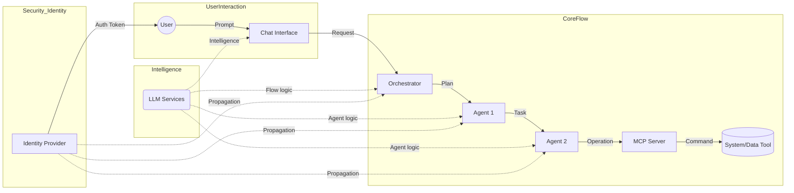
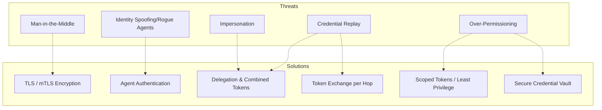
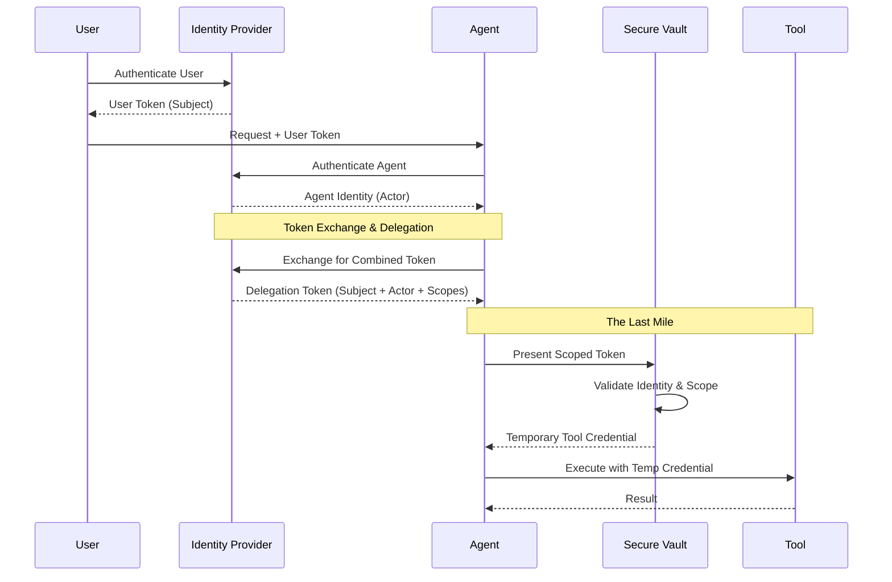

None selected 

Skip to content
Using Gmail with screen readers
20 of 258,043
The KV Cache Wars?
Inbox

Ken Huang from Agentic AI <kenhuangus@substack.com> Unsubscribe
11:37 AM (3 hours ago)
to me

Forwarded this email? Subscribe here for more
The KV Cache Wars?
Ken Huang
Apr 6
∙
Preview

 

READ IN APP
 
Something quiet but consequential is happening beneath the surface of Agentic AI infrastructure. While the discourse tends to focus on benchmark scores and reasoning capabilities, a different battle has been raging in frontier research labs, GPU memory hierarchies, and conference proceedings: the war over the KV cache.

This battle matters because it defines the boundary of what agentic AI can actually do. Context windows measured in millions of tokens, always-on agents that maintain memory across days of interaction, multi-model pipelines coordinating across workloads — none of these work at scale without solving the memory problem that sits at the center of transformer inference. That problem is the key-value cache.

This blog post cover the following topics

The Core Problem
Every decoder-only transformer model — GPT, Llama, Gemini, DeepSeek, all of them — generates text autoregressively. Each new token attends to every previous token in the context. Without caching, this requires recomputing the key and value matrices for every prior token on every single forward pass. The compute cost is quadratic in context length: double the context, quadruple the computation.

The KV cache solves this by storing those key and value projections in memory so they never need to be recomputed. This is the right trade — swapping compute cost for memory cost. But the trade has limits. The KV cache grows linearly with context length, linearly with the number of transformer layers, linearly with batch size, and linearly with the number of key-value heads. At a 128K context window on a 70B-parameter model, that linear growth adds up to roughly 42 gigabytes of KV cache memory alone — leaving almost nothing for model weights on an 80 GB card.

The situation breaks down across two stages of inference in distinct ways. During prefill, where the model ingests the entire prompt at once, a large context demands an enormous immediate block of compute and memory, slowing time-to-first-token. During decode, where the model generates new tokens one by one, the sheer resident size of the KV cache creates memory bandwidth pressure that caps throughput — the GPU is often waiting on memory reads, not compute.

As agentic workflows have grown more common and context windows have extended toward millions of tokens, these two bottlenecks have merged into a single architectural challenge that the entire industry is attacking simultaneously from different angles. The approaches fall into three broad families: reducing what gets stored through eviction and sparse attention, compressing what gets stored through quantization and dimensionality reduction, and rethinking where context lives through hierarchical memory and hardware innovation.

Before evaluating any optimization strategy, it helps to have a precise mental model of the four layers that sit between a user’s prompt and a generated token. Each layer has its own failure mode, its own memory budget, and its own relationship to the layers above and below it. Conflating them is the most common reason engineers reach for the wrong tool.

The context window: a growing sequence of decisions
Every token the model has ever seen in the current session lives in the context window. Tokens arrive left to right — the prompt first, then each newly generated token appended to the right edge — and the window grows by exactly one position with each generation step. There is no forgetting, no summarization, no compression happening at this layer. The context window is simply the authoritative ordered record of the conversation so far.

What makes the context window architecturally important is that the current query token — the token the model is about to predict past — must compute its relationship to every prior token in that sequence. This is not a design choice that can be relaxed without changing the model’s fundamental behavior. Attention is defined as a function of the current query against all prior keys and values. The query token drives all downstream computation; every other token in the window is a passive participant being looked up.

As the context grows, so does the computational cost of that lookup — quadratically under naive full attention, and linearly in memory regardless of the attention strategy. A 128K-token context is not eight times more expensive than a 16K context in some abstract sense: it requires eight times as much KV cache storage, and under full attention it requires 64 times as much attention computation. These two costs scale differently, which is why eviction strategies (which attack compute) and compression strategies (which attack memory) solve different parts of the same problem.

The KV cache: two matrices that remember everything
When the transformer processes the context, it projects every token’s embedding into three vectors: a query (Q), a key (K), and a value (V). The query is used only for the current step and discarded. The key and value vectors, however, need to be available at every future step — because every future query token will need to attend over them. Recomputing them from scratch on each step would cost as much as running the entire forward pass again for every prior token, which is prohibitively expensive at scale...

Keep reading with a 7-day free trial
Subscribe to Agentic AI to keep reading this post and get 7 days of free access to the full post archives.

Start trial
A subscription gets you:
Subscriber-only posts and full archive
Post comments and join the community
Yealy subscriber can book 30 minutes virtual meeting with me by sending me an email.
 
Like
Comment
Restack
 
© 2026 ken
University of San Francisco, San Francisco, CA 94104
Unsubscribe

Start writing

Compose:
New Message
MinimizePop-outClose

Forwarded this email? Subscribe here for more
What Andrej Karpathy Got Right: How a Local LLM Wiki Beats RAG? How do we leverage the latest Google Gemma 4 models for local intelligence?
Ken Huang
Apr 5
∙
Preview

 

READ IN APP
 
In a recent gist, Andrej Karpathy articulated a vision that resonates deeply with anyone drowning in a sea of raw information. The core insight? Conventional RAG is fundamentally transient. Every time you ask a question, the LLM rediscovers knowledge from scratch. There is no accumulation. No compounding. No persistent artifact that grows richer with every source you read.

The solution is a persistent, LLM-maintained wiki — a structured, interlinked collection of markdown files that sits between you and your raw sources.

“There is no accumulation. No compounding. No persistent artifact that grows richer with every source you read.”

The Vision: Manual Ingestion as Current Best Practice
Karpathy suggests that the highest-fidelity way to build such a system is through manual ingestion. You read a paper, you discuss it with the agent, and you guide it as it updates the index, entity pages, and log. This human-in-the-loop approach is undoubtedly best practice; it ensures that every claim added to your knowledge graph is verified, contextualized, and truly understood by the human who owns it.

However, in the hyper-dynamic landscape of AI research and cybersecurity, many find themselves in a race against time. If you don’t have the luxury of manual review for every incoming paper or advisory — but still want to bootstrap a high-quality knowledge graph — you need a prototype for autonomous ingestion.

This is what we will cover in this short article, for full details, please subscriber and for codebase see our github repo.

Keep reading with a 7-day free trial
Subscribe to Agentic AI to keep reading this post and get 7 days of free access to the full post archives.

Start trial
A subscription gets you:
Subscriber-only posts and full archive
Post comments and join the community
Yealy subscriber can book 30 minutes virtual meeting with me by sending me an email.
 
Like
Comment
Restack
 
© 2026 ken
University of San Francisco, San Francisco, CA 94104
Unsubscribe

Start writing

Compose:
New Message
MinimizePop-outClose

You have one new message. 

Skip to content
Using Gmail with screen readers
2 of 3,647
MLOps and LLMOps Case Studies
Inbox

Daily Dose of DS <avi@dailydoseofds.com> Unsubscribe
9:25 PM (1 hour ago)
to me

​Master Full-stack AI Engineering​

In today's newsletter:
MLOps and LLMOps case studies.
​The anatomy of a Claude prompt.
Euclidean distance vs. Mahalanobis distance!
TODAY'S ISSUE

production ML
MLOps and LLMOps case studies
With 32 chapters across the MLOps and LLMOps course, we have covered everything from fundamentals to fine-tuning to inference optimization to serving.

We have our final chapter now, and it is one of the most valuable ones.

​Read the final chapter of the MLOps/LLMOps course here →​

​MLOps/LLMOps case studies

This chapter is different from the rest. It shows you how companies like Booking.com, Uber, Stripe, Doordash, and many across big tech, fintech, banking, and e-commerce actually think about ML and AI systems in production.

These are real case studies with real constraints, real failures, and the decisions that shaped how these systems were built.

One example: Booking.com deployed 150+ production models and found that improving model accuracy often did not improve business outcomes at all.

The reasons why are worth understanding deeply to better approach ML projects.

​Read the final chapter of the MLOps/LLMOps course here →​

Why care?
When an ML system breaks in production, it is rarely due to the model architecture. Instead, it’s a silent distribution shift, stale embeddings in the feature store, label leakage the eval pipeline did not catch, or KV caches sized for 512 tokens when production prompts routinely hit 4,000+.

The interesting engineering lives in these operational layers when building reproducible pipelines, data versioning, CI/CD for model deployment, drift monitoring with Evidently and Prometheus, context engineering for LLMs, inference optimization via PagedAttention and continuous batching, serving topology decisions that directly shape cost and latency at scale.

MLOps and LLMOps are the disciplines that bring structure to all of this.

They take the entire surface area around a model, from how training data is tracked and validated, to how inference is optimized and served, to how evaluation catches regressions before users do, and turn it into something repeatable, observable, and maintainable.

The MLOps course (18 parts) covers the full lifecycle of traditional ML in production: reproducibility and versioning with W&B, data and pipeline engineering including sampling, feature stores, and distributed processing, model development and optimization through hyperparameter tuning, pruning, compression, and quantization, deployment via containerization, Kubernetes, AWS, and EKS, monitoring and observability with Evidently, Prometheus, and Grafana, and CI/CD workflows.

The LLMOps course (14 parts) transitions to the new set of challenges that come with foundation models: tokenization, embeddings, and attention internals, context engineering and prompt management, evaluation of open-ended generations including multi-turn and tool use, fine-tuning with LoRA, QLoRA, RLHF, DPO, and GRPO, inference optimization covering KV caching, PagedAttention, FlashAttention, and speculative decoding, and LLM serving concepts including self-hosted vs. API-based access and deployment topology.

You can start reading them here:

​MLOps course (18 parts)​
​LLMOps course (14 parts)​
Thanks for reading!

Claude
​The anatomy of a Claude prompt​
The difference between a mediocre Claude output and a great one almost always comes down to how you structure your prompt. This involves a clear, repeatable structure that gives Claude exactly what it needs to do the job well.

Here's how a well-built Claude prompt breaks down into 8 building blocks, each doing one job:

1) Role
Tell Claude who it is before telling it what to do.

"You are a [ROLE] with expertise in [DOMAIN]. Your tone should be [TONE]. Your audience is [AUDIENCE]."

Setting a role in the system prompt changes how Claude reasons, what it prioritizes, and how it communicates. A "senior backend engineer" writes differently than a "technical copywriter," and Claude picks up on that distinction immediately.

2) Task
State what you want and what success looks like, in the same breath.

"I need you to [SPECIFIC TASK] so that [SUCCESS CRITERIA]."

The "so that" part is what people skip, and it's the part that matters. It gives Claude a way to evaluate its own output. Without it, Claude is guessing what "good" means.

Be direct, skip the preamble, and cut the fluff.

3) Context
This is where you feed Claude everything it needs to do the job well.

Wrap it in XML tags like <context> and </context>, then paste your documents, data, or background inside.

One thing that dramatically improves quality: put long documents at the top of your prompt and your actual query at the end. Anthropic's own testing shows this can improve response quality by up to 30%, especially with complex, multi-document inputs.

4) Examples
Nothing steers output quality like showing Claude what "good" looks like.

Provide 3-5 input/output pairs. Cover normal cases AND edge cases. Wrap them in <examples> tags so Claude doesn't confuse them with instructions.

Claude pays extremely close attention to examples. If your example has a quirk you didn't intend, Claude will replicate it. So make sure every example models the behavior you actually want.

5) Thinking
For anything requiring reasoning, analysis, or multi-step logic, ask Claude to think before answering.

"Before answering, think through this step by step. Use <thinking> tags for your reasoning. Put only your final answer in <answer> tags."

This separates the messy reasoning from the clean output. You get to see how Claude arrived at its answer without that reasoning cluttering the final result.

6) Constraints
Every good prompt has guardrails.

"Never [thing to avoid]. Always [thing to ensure]. If you are about to break a rule, stop and tell me."

That last line is underrated. It turns Claude into a collaborator instead of a blind executor. Instead of silently violating a constraint, Claude flags the conflict and lets you decide.

7) Output Format
Don't leave the format to chance.

"Return your response as [JSON / markdown / table / prose]. Use this exact structure: [structure template]."

If you want JSON, show the exact schema. If you want markdown, show the heading structure. If you want a table, define the columns. The more specific you are about shape, the less time you spend reformatting afterward.

8) Prefill
This one is API-specific, but incredibly powerful.

You can pre-fill the start of Claude's response to skip preamble and lock in the format. Claude will continue from exactly where you left off. No "Sure, I'd be happy to help!" opening, no throat-clearing, just clean output from the first token.

Here's the thing people get wrong about prompting: they think it's about finding the right words. It's actually about giving Claude the right structure.

If you want to go deeper, we wrote a detailed article covering the anatomy of the .claude/ folder, a complete guide to CLAUDE(.)md, hooks, skills, agents, and permissions, and how to set them all up properly.

​You can read it here →​

data science
​Euclidean Distance vs. Mahalanobis Distance!​
Consider the three points below in a dummy dataset with correlated features:

According to Euclidean distance, P1 is equidistant from P2 and P3.

But if we look at the data distribution, something tells us that P2 should be considered closer to P1 than P3 since P2 lies more within the data distribution.

Yet, Euclidean distance can not capture this.

Mahalanobis distance addresses this issue.

It is a distance metric that considers the data distribution during distance computation.

Referring to the above dataset again, with Mahalanobis distance, P2 comes out to be closer to P1 than P3:

How does it work?
The core idea is similar to what we do in ​Principal Component Analysis (PCA)​.

More specifically, we construct a new coordinate system with independent and orthogonal axes. The steps are:

Step 1: Transform the columns into uncorrelated variables.
Step 2: Scale the new variables to make their variance equal to 1.
Step 3: Find the Euclidean distance in this new coordinate system.
So, eventually, we do use Euclidean distance, but in a coordinate system with independent axes.

Uses
One of the most common use cases of Mahalanobis distance is outlier detection.

For instance, in this dataset, P3 is an outlier but Euclidean distance will not capture this.

But Mahalanobis distance provides a better picture:

Moreover, there is a variant of kNN that is implemented with Mahalanobis distance instead of Euclidean distance.

Further reading:

​​We covered 8 more pitfalls in data science projects here →​​
​​This mathematical discussion on the curse of dimensionality will help you understand why Euclidean produces misleading results in high dimensions.
👉 Over to you: What are some other limitations of Euclidean distance?

THAT'S A WRAP

NO-FLUFF RESOURCES TO...
​Succeed in AI Engineering roles​

All businesses care about impact. That’s it!

Can you reduce costs?
Drive revenue?
Can you scale ML models?
Predict trends before they happen?
We have discussed several other topics (with implementations) in the past that align with such topics.

Master full-stack AI engineering
Here are some of them:

Learn MLOps from first principles to production in this course with 18 parts →​
Learn everything about MCPs in this course with 9 parts →​
Learn how to build Agentic systems in this course with 14 parts.
Learn how to build real-world RAG apps, evaluate, and scale them in this course.
Learn sophisticated graph architectures and how to train them on graph data in this course.
So many real-world NLP systems rely on pairwise context scoring. Learn scalable approaches here.
Learn how to run large models on small devices using Quantization techniques.
Learn how to generate prediction intervals or sets with strong statistical guarantees for increasing trust using Conformal Predictions.
Learn how to identify causal relationships and answer business questions using causal inference in this course.
Learn how to scale and implement ML model training in this practical guide.
Learn techniques to reliably test new models in production.
Learn how to build privacy-first ML systems using Federated Learning.
Learn 6 techniques with implementation to compress ML models.
Master full-stack AI engineering
All these resources will help you cultivate key skills that businesses and companies care about the most.

​
Partner with US
ADVERTISE TO 900k+ AI Professionals
Our newsletter puts your products and services directly in front of an audience that matters, including thousands of leaders, senior data scientists, machine learning engineers, data analysts, etc., around the world.

Get in touch today by replying to this email.

Today’s email was brought to you by Avi Chawla and Akshay Pachaar.

​Update your profile | Unsubscribe​

Looking for more? Unlock our premium DS/ML resources.

​

© 2026 Daily Dose of Data Science

Compose:
New Message
MinimizePop-outClose
Skip to main content
Daily Dose of Data Science
Newsletter
Guidebooks
Courses

Sign In
Get Started
MLOps/LLMOps Course
MLOps
Background and Foundations for ML in Production
The Machine Learning System Lifecycle
Reproducibility and Versioning in ML Systems: Fundamentals of Repeatable and Traceable Setups
Reproducibility and Versioning in ML Systems: Weights and Biases for Reproducible ML
Data and Pipeline Engineering: Data Sources, Formats, and ETL Foundations
Data and Pipeline Engineering: Sampling, Data Leakage, and Feature Stores
Data and Pipeline Engineering: Distributed Processing and Workflow Orchestration
Model Development and Optimization: Fundamentals of Development and Hyperparameter Tuning
Model Development and Optimization: Fine-Tuning, Pruning, and Efficiency
Model Development and Optimization: Compression and Portability
Model Deployment: Serialization, Containerization and API for Inference
Model Deployment: Kubernetes
Model Deployment: Cloud Fundamentals
Model Deployment: Introduction to AWS
Model Deployment: EKS Lifecycle and Model Serving
Monitoring and Observability: Core Fundamentals
Monitoring and Observability: Practical Tooling with Evidently, Prometheus, and Grafana
CI/CD Workflows
LLMOps
Foundations of AI Engineering and LLMs
Building Blocks of LLMs: Tokenization and Embeddings
Building Blocks of LLMs: Attention, Architectural Designs and Training
Building Blocks of LLMs: Decoding, Generation Parameters, and the LLM Application Lifecycle
Context Engineering: Foundations, Categories, and Techniques of Prompt Engineering
Context Engineering: Prompt Management, Defense, and Control
Context Engineering: An Introduction to the Information Environment for LLMs
Context Engineering: Memory and Temporal Context
Evaluation: Fundamentals
Evaluation: Model Benchmarks and LLM Application Assessment
Evaluation: Multi-turn Conversations, Tool Use, Tracing, and Red Teaming
LLM Fine-tuning: Techniques for Adapting Language Models
LLM Inference and Optimization: Fundamentals, Bottlenecks, and Techniques
Concepts of LLM Serving
Miscellaneous
MLOps and LLMOps: Case Studies
MLOps/LLMOps Course
33/33
 
22 min read
MLOps and LLMOps: Case Studies
An exploration of real-world MLOps and LLMOps case studies, examining the importance of reliable ML and AI engineering and their significance for business outcomes.

👉
Hey! This is a member-only post. But it looks like you are from Nigeria 🇳🇬. Join today by visiting this membership page for relief pricing of 50% off on your full access, FOREVER.
Introduction
Several AI/ML systems do not just fail because the model is not good enough. They fail because everything around the model was not built to last.

Consider a scenario: A team trains a model, it performs well in tests, and it is deployed to production. Yet conversion rates remain flat. A question from the finance team cannot be answered. Engineers spend weeks investigating why a recommendation system with 94% accuracy is making the product no better. This is not an edge case, rather a reflection of how real-world systems behave.

The companies that eventually get this right, do so by learning lessons that do not always have much to do with algorithms. Their progress comes from how they design systems, handle constraints, and adapt to failure.

This article is the final piece in our MLOps/LLMOps course. Here, we take a look at concrete, real-world examples. We examine a set of carefully chosen case studies drawn from real systems. Each case study focuses on the decisions that shaped the system, why specific approaches were chosen and the constraints teams operated under.

The examples span big tech, fintech, banking, e-commerce, etc. offering a grounded view of how modern AI/ML systems are actually built and sustained.

👉
We have no affiliation, partnership, or association (in any capacity) with any of the companies referenced in these case studies. All trademarks and logos remain the property of their respective owners and are used solely for identification and educational purposes.
#1) The fundamental misunderstanding
Booking.com: Model performance ≠ Business performance
In 2019, Booking.com published a paper at KDD that has changed how most companies today think about ML.

Booking.com: Global News logo
It described 150 deployed production models and one uncomfortable lesson: improving a model's accuracy often did not improve the business metric it was supposed to affect.

There were several reasons for this:

Value saturation: the model had already captured most of the available gain, and further accuracy improvements had nothing much left to unlock.
Segment saturation: when testing a new model against the current one, the two models increasingly agree on what to show users, shrinking the population actually exposed to any difference. The testable segment becomes too small to move aggregate metrics.
Proxy metric over-optimization: the model had learned to maximize something measurable that was only loosely correlated with what the business actually cared about.
👉
This means the model gets better at predicting the label it was trained on, but that label is an imperfect proxy for the business outcome.
Uncanny valley effect: as a model becomes too accurate (predicting user behavior so precisely that it feels like the system knows too much), it can unsettle users, producing a negative effect on business value.
Their solution was to treat randomized controlled trials (RCTs) as mandatory infrastructure, not optional validation.

👉
A randomized controlled trial (RCT) is a type of scientific experiment designed to evaluate the efficacy of an intervention by minimizing bias through the random allocation of participants to one or more comparison groups.
This means every single model gets validated through an RCT before it stays in production. This was not a qualitative review or a conversation about the AUC, but rather an actual experiment measuring whether users behaved differently in a way that matters to the business.

The deeper insight was about how teams construct problems. Switching a preferences model from click data to natural language processing on guest reviews produced more business value than any model-level improvement had. The framing of the problem and project scoping mattered more than the sophistication of the solution.

 
 
 
This lesson is for paying subscribers only
Unlock Full Access
Already have an account? Sign in

Published on Apr 6, 2026
Share
Previous — LLMOps
Concepts of LLM Serving
On this page

Introduction
#1) The fundamental misunderstanding
Booking.com: Model performance ≠ Business performance
Daily Dose of Data Science
A daily column with insights, observations, tutorials and best practices on python and data science. Read by industry professionals at big tech, startups, and engineering students.
Menu
Contact
FAQ
Daily Dose of Data Science © 2026

None selected

Skip to content
Using Gmail with screen readers
is:important 
21 of 3,660
Keparthy
Inbox

Adedoyinsola Ogungbesan <jdmasciano2@gmail.com>
Thu, Apr 2, 10:42 PM (3 days ago)
to me

LLM Knowledge Bases

Something I'm finding very useful recently: using LLMs to build personal knowledge bases for various topics of research interest. In this way, a large fraction of my recent token throughput is going less into manipulating code, and more into manipulating knowledge (stored as markdown and images). The latest LLMs are quite good at it. So:

Data ingest:
I index source documents (articles, papers, repos, datasets, images, etc.) into a raw/ directory, then I use an LLM to incrementally "compile" a wiki, which is just a collection of .md files in a directory structure. The wiki includes summaries of all the data in raw/, backlinks, and then it categorizes data into concepts, writes articles for them, and links them all. To convert web articles into .md files I like to use the Obsidian Web Clipper extension, and then I also use a hotkey to download all the related images to local so that my LLM can easily reference them.

IDE:
I use Obsidian as the IDE "frontend" where I can view the raw data, the the compiled wiki, and the derived visualizations. Important to note that the LLM writes and maintains all of the data of the wiki, I rarely touch it directly. I've played with a few Obsidian plugins to render and view data in other ways (e.g. Marp for slides).

Q&A:
Where things get interesting is that once your wiki is big enough (e.g. mine on some recent research is ~100 articles and ~400K words), you can ask your LLM agent all kinds of complex questions against the wiki, and it will go off, research the answers, etc. I thought I had to reach for fancy RAG, but the LLM has been pretty good about auto-maintaining index files and brief summaries of all the documents and it reads all the important related data fairly easily at this ~small scale.

Output:
Instead of getting answers in text/terminal, I like to have it render markdown files for me, or slide shows (Marp format), or matplotlib images, all of which I then view again in Obsidian. You can imagine many other visual output formats depending on the query. Often, I end up "filing" the outputs back into the wiki to enhance it for further queries. So my own explorations and queries always "add up" in the knowledge base.

Linting:
I've run some LLM "health checks" over the wiki to e.g. find inconsistent data, impute missing data (with web searchers), find interesting connections for new article candidates, etc., to incrementally clean up the wiki and enhance its overall data integrity. The LLMs are quite good at suggesting further questions to ask and look into.

Extra tools:
I find myself developing additional tools to process the data, e.g. I vibe coded a small and naive search engine over the wiki, which I both use directly (in a web ui), but more often I want to hand it off to an LLM via CLI as a tool for larger queries.

Further explorations:
As the repo grows, the natural desire is to also think about synthetic data generation + finetuning to have your LLM "know" the data in its weights instead of just context windows.

TLDR: raw data from a given number of sources is collected, then compiled by an LLM into a .md wiki, then operated on by various CLIs by the LLM to do Q&A and to incrementally enhance the wiki, and all of it viewable in Obsidian. You rarely ever write or edit the wiki manually, it's the domain of the LLM. I think there is room here for an incredible new product instead of a hacky collection of scripts. 

Compose:
New Message
MinimizePop-outClose

Below is the transcript of the video followed by Mermaid diagrams illustrating the concepts discussed.

### Video Transcript: Building Trust and Security in Agentic AI Systems

**Grant Miller (Distinguished Engineer, IBM):**
Howdy everyone. In this video, we will look at how to ensure secure and reliable AI interactions and discuss how trust is established and maintained across agentic AI systems. As part of establishing trust, the concept of verifiable agent identities is also explored.

Building trust and security for IT systems has long been part of what we do. The first real standards actually emerged back in 1985 around security. And while AI systems are like those in many ways, there are unique challenges that bring new risk, especially when we consider the non-deterministic behavior of AI interactions.

All right, let's start by drawing a typical AI or agentic flow. We start with a **user**, and that user interacts with a **chat**. That chat then determines what the user's going to do and goes to an **orchestrator**. And that orchestrator determines, okay, how is this flow ultimately going to look? So we may have a couple of **AI agents** (A1, A2). We could have one, we could have multiple of these. The orchestrator creates a flow to interact. 

And then ultimately, we're going to have some **tool** that we want to connect to, whether that's data or systems. And now we see an emergence of **MCP servers** that the agents talk to, and then that ultimately talks into the tool. All right, so that's our first flow. 

Now, also in agentic systems, we have **LLMs**. And these LLMs can help us in a variety of places. They may work with the chat, they may work with the orchestrator to give some intelligence to developing the flow, they may work with each of the individual agents as we determine what they need to do and how they're going to respond to a prompt from the original user.

The other thing that we see a lot of is we have a company's **identity provider (IdP)** that's basically authenticating the user. We authenticate the user at the very beginning, and that results in a **token** that we then can propagate through the whole flow down to the tool. And that says who the user is, so we know what kinds of things at the tool the user is allowed to do. So this is a typical agentic flow.

So let's start thinking about then, all right, what are some of the things that where there's risk and where there's errors that we need to take into consideration? Well, the first thing that we really want to think about is a **credential replay**. And what this basically says is that there is some other person that wants to take over the identity of who we think is using the system, gain their privileges and their accesses, and then use that token in a bad way to propagate through and get access to things that we don't want them to get access to. 

Now, so how can this happen when we have a particular flow? Well, there's several ways that this can happen. One of the ways is that in our development of our agentic system, we may actually in any of these steps send up our token that was authenticated here into the LLM as part of just the communication with the LLM. And what happens is now it's embedded in the LLM, and a bad actor can actually use prompt engineering to get the LLM to give up that token, get access to that token or the credentials, and then use that along the process. 

The other thing that can happen is we can have a **man-in-the-middle (MITM)** attack where somewhere along this path there's somebody that's inserted themselves because we have a non-secure flow or non-secure stores, and they can actually intercept these tokens, get a hold of them, and then use them to replay again and get access to things that we don't want them to get access to. 

So in this part of this, how do we prevent these kinds of risks from happening? Well, first thing when we're talking about man-in-the-middle is we can use **TLS or mTLS** along our whole communication flow so that's encrypted and secured and we can prevent someone getting in the middle. If we store credentials, if we store anything along this flow, encrypt those where they're stored so we can do a lot to kind of prevent the man-in-the-middle. The other thing is just make sure you're not passing in identity information to the LLM. The LLM doesn't need that; it just needs to be able to organize and figure out what the task is for it. So do not send that in.

The next thing that we have to look at if we talk about securing our flows and being able to trust our agentic system is we need to look at **rogue agents**. So we have agents that are somewhere pop up and they're either communicating with some of these other agents, they're communicating with MCP, and what they're doing is they're **spoofing the identity** of these other agents. So they're saying, "Hey, I'm the real agent, talk to me and get me access to this tool." And we don't want this to happen. We want to make sure that we can trust that we know who the legitimate agents are. 

And to do that, we really start looking at, again, we take an identity provider and we start using this for agents. So we want to know the **identity of the agents** and we want to be able to **authenticate the agents**. So we have an agent come up, we have an agent come up, and we say, "Please prove you are who you say that you are." This prevents us, much like we would do with a bad actor, then a rogue agent isn't able to authenticate itself and we can trust exactly who these agents are and we know whether or not it's a rogue agent or not. And when we get to an MCP server at this point, then we can **validate**. In fact, we can actually validate it at multiple points throughout this flow. When Agent 1 is talking to Agent 2, we can go up and validate that we trust that that was an authenticated legitimate agent. Same with the MCP; we can look at Agent 2 and make sure that we trust that it was authenticated. So this is a big piece of making sure that we know who the agents are in this system. 

Now, next piece that we want to look at is **impersonation**. And what this is really saying is that even if we kind of think that we trust who an agent is, we don't want them to tell us, "Well, this is the person that I am working for," without having any validation of that individual. So in other words, the agent is impersonating the user. And so what we do here is we actually start looking at **delegation**. And this really is about having an agent work on behalf of a user. So what we want to do is make sure that we have this user properly authenticated, we take their token, and that becomes part of—once an agent authenticates itself—now we have a combined token that has the **subject (the user)** and has the **actor (the agent)**. So now when we're going through the flow, we can trust that we've authenticated the user because that's contained within our token and we can also trust that we have authenticated the agent and who they're supposed to be operating on behalf of. And all of this happens at the identity provider. Not anywhere along this way can an agent assert what it's doing; it has to be validated and provided by an independent party, in this case, which is the identity provider. So this is another piece of this. 

Now, as we talked about at the very beginning, we have these tokens that kind of flow through the system. That is also a point of risk because we just need to make sure that at each node and each hop, that token is actually the one that we trust through the entire flow. We do that through doing a **token exchange**. And what this really says is that at each node and hop, we make a call to our provider and we say, "Please exchange the incoming token for another." We know the starting point, we know the endpoint, we bring those tokens in, then we exchange it. So the trust and the validation is really for this flow, then we trust and validate for this flow. So that way, we know that everything is propagating correctly along this flow. Again, so we trust the user, trust the agents, securely move the identities through the system as we're getting it to the tools. 

The next thing that we really want to think about then is at the tool side is **over-permissioning**. And what this says is that a user could be allowed to do a lot of stuff, an agent could be allowed to do a lot of stuff, but we only want what happens within this flow to only be what is needed for the prompt that's happening and what is the actual tool that we need to connect to. A user may be able to connect to lots of tools, but in the context of this flow, we only want to be able to show what that user can connect to, same with the agents. 

And this really gets then into **scopes**. When we do these exchanges at each node of this flow, we're validating everything, but we're also restricting the scopes in the token to only be what is necessary. Agent 1 can talk to Agent 2; it has an audience of Agent 2. Agent 2 can connect with this tool; so we go through MCP and we validate all this. So this really then gets us a good end-to-end flow that we can now trust. 

Now, the final piece that we want to think about when we're looking at how do we trust and secure our agentic system is really the **last mile**. And this is really happening between MCP and the tool. From this point, it's tokens, it's flowing, we are trusting, we are validating. But now the MCP server is going to talk to a tool, and it may do that over an API, it may do that over a variety of different mechanisms which really are not necessarily what we've established in the flow. So how do we do that? We don't want the MCP server to store and keep credentials that it uses to access the tool because now we have a potential risk and exposure here. So what we do for the last mile is we introduce a **vault**, a secure vault. And this manages the credentials to the tool and then feeds a **temporary credential** to MCP. So we have the user, we have the agent, it wants to connect to a tool, it does an exchange within a vault to get a temporary credential that is used for the tool, and now we connect to the tool. 

All right, so this is a good view of how we can start through a typical agentic system and do things with **trust**, where we trust the identities and we trust the authentication, so we know who is operating across this flow and we trust that. We also can make sure that we're doing **secure flows**, and this is really about **authorization**, which ultimately is our scopes and what we're allowing and using least privilege. It is also about **delegation**, making sure that the agents, we know who they are and they're working on behalf of a user and we can trust those two components. And then it's about **propagation**—can all this information be securely transferred along our agentic flow and back to the results of the prompt? And doing these things will allow you to have trust in that agentic system.

---

### Mermaid Diagrams

#### 1. Typical Agentic AI Flow
This diagram illustrates the logical flow of a user request through an agentic system, including the supporting infrastructure like LLMs and Identity Providers.

#### 2. Risks vs. Security Solutions
This diagram highlights the specific threats mentioned in the video and the corresponding architectural solutions used to mitigate them.

#### 3. The Secure Token & Last Mile Architecture
This diagram focuses on the "trust chain" — how identities are combined and how the final connection to the tool is secured using a vault.

0 notifications total

Skip to search

Skip to main content

Keyboard shortcuts
Close jump menu
Search
new feed updates notifications
Home
My Network
Jobs
Messaging
9
9 new notifications
Notifications
Adedoyinsola Ogungbesan
Me

For Business
Reactivate Premium: 50% Off

Determinism - “It Works Everywhere, Every Time”
Dave Farley
Dave Farley
Independent Software Developer and Consultant, Founder and Director of Continuous Delivery Ltd.

March 27, 2026
Most software systems fail for one very boring reason.

Not microservices. Not monoliths. Not agile. They fail because they're unpredictable. If I make a change and I can't reliably determine the impact of that change, then I can't safely evolve my system. And if I can't evolve my system, then it's already a legacy system.

I think that a lot of people miss the importance of this: determinism. Not as some academic ideal, but as the bridge between "it works on my machine" and "it works every time, everywhere."

The Trust Problem

There's a chain of facts: You can't evolve what you can't measure. You can't measure what you can't repeat. And you can't repeat something that isn't deterministic.

That leaves the determinism of our systems as a key attribute that enables us to improve them.

If our tests are flaky, if our builds sometimes fail "for reasons," if concurrency randomly breaks things — then our delivery pipeline stops being a learning system. It becomes a form of release theatre instead. Our tests lie to us. Our pipeline lies to us and our architecture rots quietly in the background.

Time Is the First Trap

If your code calls datetime.now directly, you've just injected nondeterminism into your system. The same input tomorrow produces a different output. That's not testable. That's not reproducible.

The fix is simple: inject a clock. Pass time as data. Treat "now" as an input. Suddenly you can freeze time, fast-forward it, reproduce production bugs by replaying timestamps. You've turned the universe into a parameter — and that's a pretty powerful tool.

Separate What Decides from What Acts

If you take one idea from this, take this one: separate the code that decides from the code that acts.

A deterministic core — pure logic, state in, decision out, no database, no clock, no randomness. And an imperative shell — the messy part that talks to the real world.

This is really just hexagonal architecture, ports and adapters, but framed around evolutionary capability. When the core is pure, you don't need mocks. You don't need frameworks. You don't need complex test scaffolding. You pass in state, you assert on output, and you can run thousands of tests in milliseconds. These tests are your fitness functions, that guide the evolution of your design and system.

It's a Systems Property, Not a Coding Trick

This goes beyond code. Hermetic builds. Pinned dependencies. Idempotent deployments all help us to grow our systems. If applying your deployment twice changes the result, your infrastructure is non-deterministic — and your production environment is a mystery wrapped in an enigma.

Most organisations optimise for features. But the best organisations optimise for speed of learning. Deterministic systems shorten feedback loops, reduce cognitive load, make debugging reproducible. They enable aggressive experimentation.

This is why continuous delivery works — not because of pipelines, but because of determinism. The pipeline is just an amplifier that helps us see more easily how close we are to our target.

Learn more with my free course:

https://courses.cd.training/courses/design-to-manage-complexity

#SoftwareEngineering #ContinuousDelivery #SoftwareArchitecture #Determinism #HexagonalArchitecture #EvolutionaryArchitecture

Comments
likeinsightfulcelebrate
120
15 comments
8 reposts

Photo of Adedoyinsola Ogungbesan

like
Like

Comment

Share

Add a comment…
Open Emoji Keyboard

Current selected sort order is Most recent
Most recent
View James Galyen’s  graphic link
James Galyen
   • 3rd+
Application Developer at Press Ganey LLC
1w

AI nondeterminism: 60% of the time, it works every time. It's illegal in nine countries... Yep, it's made with bits of other people's code, so you know it's good.

"The code smells like a diaper filled with Indian food!" and "like Bigfoot rolled around in a garbage dump"

AI: "I don't know how to put this, but I'm kind of a big deal. People know me."
…more

Like
funny
4

Reply
5 replies
5 Replies on James Galyen’s comment

See previous replies
View James Galyen’s  graphic link
James Galyen
   • 3rd+
Application Developer at Press Ganey LLC
1w

Stijn Dejongh "The Developers" instead of "The Expendables" would be a great movie too

Much of the best open source software was written by Chuck Norris, blindfolded, with only his pinky as he slept. No test, no syntax errors, no bugs

"Chuck Noris saves the World" documentary is awesome, btw. His movies being translated into Russian and smuggled in brought about the end of the cold war and peace agreement on nuclear armaments. He really did save the world
…more
Comment image, no alternative text available

Like
like
1

Reply
View Peter Gillard-Moss’  graphic link
Peter Gillard-Moss
   • 3rd+
Technology leader | QCon, GOTO, Conference speaker | Gousto, ex-DeepL, ex-Thoughtworks
1w

Eliminating unwanted or unnecessary variation is key and definitely puts engineers on a spectrum of how they see this.

Years ago everyone got shiny Macs including my team. But we dual booted into RH Linux. This wasn’t popular with many of the engineers. I had to explain that we were deploying to RHL so we developed on RHL. We minimised the variance as much as we could.

This meant taking on a lot of pain. MacOS was a much better environment, IDEs were better, RHL was often behind on package versions that would be helpful.

But our software was rock solid, easy to debug and predictable.

When learning Clojure I remeber having the same Aha! Around keeping functions side effect free as much as possible
…more

Like
like
4

Reply
View Tomasz Borzyszkowski’s  graphic link
Tomasz Borzyszkowski
   • 3rd+
Software Architect & Lecturer
1w

Excellent framing. "Deterministic Core vs. Imperative Shell" is the perfect modern evolution of Dijkstra’s 1974 Separation of Concerns.
If "you can’t evolve what you can’t repeat," then determinism is our most valuable asset. This is especially true today with GenAI:

- AI belongs in the Shell: Treat LLMs as volatile, non-deterministic I/O

- The Core stays pure: Your logic shouldn't "vibe": it should be predictable and testable

Building on top of unpredictable components (AI/Time/IO) requires a "thick" shell and a "pure" core. Great read!
…more

Like
like
4

Reply
View Simon Jones’  graphic link
Simon Jones
   • 3rd+
I test and Eval AI | Senior SDET 12+years | Automation Testing · LLM Evaluation · Hallucination Detection · Adversarial Prompting · Agentic AI Testing · Prompt Injection Auditing · AI Safety Testing · Red Teaming
1w

Be interested in your thoughts on how we build systems at the point where determinsm & non determinism collide for example in an AI agent that must do its job repeatedly & to a standard. ?

Like
like
1

Reply
3 replies
3 Replies on Simon Jones’ comment

See previous replies
View Simon Jones’  graphic link
Simon Jones
   • 3rd+
I test and Eval AI | Senior SDET 12+years | Automation Testing · LLM Evaluation · Hallucination Detection · Adversarial Prompting · Agentic AI Testing · Prompt Injection Auditing · AI Safety Testing · Red Teaming
1w

Ian Letourneau thanks for the reply . More fascinating concepts to learn . 👍

Like

Reply
View Jim McMullen’s open to work graphic link
Jim McMullen
   • 3rd+
Head of Engineering | Building Data-Driven SaaS Platforms | Health-Tech & Data SaaS | Startup Technical Leadership
1w

After writing code for decades, I thought I understood determinism. The concepts aren't new to me. But this article reframed something I hadn't fully articulated: I've been treating determinism as a property my code happens to have - not as a design discipline I actively enforce. I'm thinking back through some of my work asking 'is this deterministic by design?'
…more

Like

Reply
View Ken Pugh’s  graphic link
Ken Pugh
   • 3rd+
Build-in Quality with BDD/ATDD | Technical Agility, Technical Excellence | Co-creator SAFe Agile Software Engineering | Effective Software Development (Design Patterns, Lean, Agile, Scrum, Kanban) | TBR-CT | Training
1w

Being able to set the date to test programs has been around since Cobol in the 60's😀

Like

Reply
View Rodo P’s  graphic link
Rodo P
 • 3rd+
Software Engineer | Full Stack, Python,FastAPI ,Django, React,JavaScript,CSS ,HTML, GCP ,Docker Kuberentes
1d

you will get that with physics and math 

Like

Reply
Dave Farley
Dave Farley

Independent Software Developer and Consultant, Founder and Director of Continuous Delivery Ltd.

Following
About
Accessibility
Talent Solutions
Professional Community Policies
Careers
Marketing Solutions

Privacy & Terms 
Ad Choices
Advertising
Sales Solutions
Mobile
Small Business
Safety Center
Questions?
Visit our Help Center.

Manage your account and privacy
Go to your Settings.

Recommendation transparency
Learn more about Recommended Content.

Select Language

English (English)
LinkedIn Corporation © 2026

Adedoyinsola OgungbesanStatus is online
MessagingYou are on the messaging overlay. Press enter to open the list of conversations.

Compose message
You are on the messaging overlay. Press enter to open the list of conversations.

-----------------------------------------------------------------------harness-----------------------------

You have 3 new messages.

Skip to content Using Gmail with screen readers 1 of 3,653 The Anatomy of an Agent Harness Inbox

Daily Dose of DS avi@dailydoseofds.com Unsubscribe 10:11 PM (15 hours ago) to me

​Master Full-stack AI Engineering​

In today's newsletter: The Canvas Framework: A structured approach to building production Agents. The Anatomy of an Agent Harness. TODAY'S ISSUE

together with MongoDB​The Canvas Framework: A structured approach to building production Agents​Before foundation models, building an AI feature involved collecting and labeling training data, training a custom model from scratch, and only then integrating it into a product. This took months and a massive compute investment before teams could even test whether users wanted the feature.

Foundation models removed that bottleneck because they come pre-trained and accessible via API. Teams can now call GPT-4 or Claude with zero-shot or few-shot prompts, ship an MVP in days, validate user demand first, and only then invest in curating data for RAG or fine-tuning.

But for agentic systems, there’s a missing layer.

Agent design needs to come right after defining the product, because the agent’s capabilities, workflows, and memory requirements are what determine what knowledge it needs and which model providers make sense downstream.

MongoDB published a detailed breakdown of the Canvas Framework built around this exact sequence. It uses two planning canvases.

The POC canvas has 8 squares covering product validation, agent design (capabilities, autonomy boundaries, memory requirements), data requirements (knowledge sources, update frequency, feedback loops), and model integration (provider selection, prompt strategy, cost validation) The production canvas adds 11 squares for scaling, including fault tolerance, multi-agent coordination, unified data architecture across application storage, vector search, and agent memory, plus security hardening and governance.​You can read the full breakdown here →​

Claude The Anatomy of an Agent Harness A ReAct loop, a couple of tools, and a well-written system prompt can get surprisingly far in a demo.

But the moment the task requires 10+ steps, things fall apart like the model forgets what it did three steps ago, tool calls fail silently, and the context window fills up with garbage.

The problem isn't the model. It's everything around the model.

LangChain proved this when they changed only the infrastructure wrapping their LLM (same model, same weights) and jumped from outside the top 30 to rank 5 on TerminalBench 2.0.

A separate research project hit a 76.4% pass rate by having an LLM optimize the infrastructure itself, surpassing hand-designed systems.

That infrastructure has a name now: the agent harness.

What is Agent Harness? The term was formalized in early 2026, but the concept existed long before.

The harness is the complete software infrastructure wrapping an LLM, including the orchestration loop, tools, memory, context management, state persistence, error handling, and guardrails.

Anthropic’s Claude Code documentation puts it simply: the SDK is “the agent harness that powers Claude Code.“

We really liked the canonical formula, from LangChain’s Vivek Trivedy: “If you’re not the model, you’re the harness.”

To put it another way, the “agent” is the emergent behavior: the goal-directed, tool-using, self-correcting entity the user interacts with. The harness is the machinery producing that behavior. When someone says “I built an agent,” they mean they built a harness and pointed it at a model.

Beren Millidge made this analogy precise in his 2023 essay:

A raw LLM is a CPU with no RAM, no disk, and no I/O. The context window serves as RAM (fast but limited). External databases function as disk storage (large but slow). Tool integrations act as device drivers. The harness is the operating system.

Three levels of engineering Three concentric levels of engineering surround the model:

Prompt engineering crafts the instructions the model receives. Context engineering manages what the model sees and when. Harness engineering encompasses both, plus the entire application infrastructure: tool orchestration, state persistence, error recovery, verification loops, safety enforcement, and lifecycle management. The harness is not a wrapper around a prompt. It is the complete system that makes autonomous agent behavior possible.

The 11 components of a production Harness Synthesizing across Anthropic, OpenAI, LangChain, and the broader practitioner community, a production agent harness has eleven distinct components. Let’s walk through each one.

The Orchestration Loop This is the heartbeat. It implements the Thought-Action-Observation (TAO) cycle, also called the ReAct loop. The loop runs: assemble prompt, call LLM, parse output, execute any tool calls, feed results back, repeat until done.
Mechanically, it’s often just a while loop. The complexity lives in everything the loop manages, not the loop itself. Anthropic describes their runtime as a “dumb loop” where all intelligence lives in the model. The harness just manages turns.

Tools Tools are the agent’s hands. They’re defined as schemas (name, description, parameter types) injected into the LLM’s context so the model knows what’s available. The tool layer handles registration, schema validation, argument extraction, sandboxed execution, result capture, and formatting results back into LLM-readable observations.
Claude Code provides tools across six categories: file operations, search, execution, web access, code intelligence, and subagent spawning. OpenAI’s Agents SDK supports function tools (via function_tool), hosted tools (WebSearch, CodeInterpreter, FileSearch), and MCP server tools.

Memory Memory operates at multiple timescales. Short-term memory is the conversation history within a single session. Long-term memory persists across sessions: Anthropic uses CLAUDE.md project files and auto-generated MEMORY.md files; LangGraph uses namespace-organized JSON Stores; OpenAI supports Sessions backed by SQLite or Redis.
Claude Code implements a three-tier hierarchy: a lightweight index (~150 characters per entry, always loaded), detailed topic files pulled in on demand, and raw transcripts accessed via search only.

Context management This is where many agents fail silently. The core problem is context rot: model performance degrades 30%+ when key content falls in mid-window positions.
Even million-token windows suffer from instruction-following degradation as context grows.

Production strategies include:

Compaction: summarizing conversation history when approaching limits (Claude Code preserves architectural decisions and unresolved bugs while discarding redundant tool outputs) Observation masking: JetBrains’ Junie hides old tool outputs while keeping tool calls visible Just-in-time retrieval: maintaining lightweight identifiers and loading data dynamically (Claude Code uses grep, glob, head, tail rather than loading full files) Sub-agent delegation: each subagent explores extensively but returns only 1,000 to 2,000 token condensed summaries Anthropic’s context engineering guide states the goal: find the smallest possible set of high-signal tokens that maximize likelihood of the desired outcome.

Prompt construction This assembles what the model actually sees at each step. It’s hierarchical with system prompt, tool definitions, memory files, conversation history, and the current user message.
OpenAI’s Codex uses a strict priority stack: server-controlled system message (highest priority), tool definitions, developer instructions, user instructions (cascading AGENTS.md files, 32 KiB limit), then conversation history.

Output parsing Modern harnesses rely on native tool calling, where the model returns structured tool_calls objects rather than free-text that must be parsed.
The harness checks if there are any tool calls? If yes, it executes them and loops. If not, it gives the final answer.

For structured outputs, both OpenAI and LangChain support schema-constrained responses via Pydantic models.

Legacy approaches like RetryWithErrorOutputParser (which feeds the original prompt, the failed completion, and the parsing error back to the model) remain available for edge cases.

State management LangGraph models state as typed dictionaries flowing through graph nodes, with reducers merging updates.
Checkpointing happens at super-step boundaries, enabling resumption after interruptions and time-travel debugging.

OpenAI offers four mutually exclusive strategies: application memory, SDK sessions, server-side Conversations API, or lightweight previous_response_id chaining. Claude Code takes a different approach: git commits as checkpoints and progress files as structured scratchpads.

Error handling Here’s why this matters: a 10-step process with 99% per-step success still has only ~90.4% end-to-end success due to compounding.
LangGraph distinguishes four error types: transient (retry with backoff), LLM-recoverable (return error as ToolMessage so the model can adjust), user-fixable (interrupt for human input), and unexpected (bubble up for debugging). Anthropic catches failures within tool handlers and returns them as error results to keep the loop running. Stripe’s production harness caps retry attempts at two.

Guardrails and safety OpenAI’s SDK implements three levels: input guardrails (run on the first agent), output guardrails (run on the final output), and tool guardrails (run on every tool invocation).
A “tripwire” mechanism halts the agent immediately when triggered.

Anthropic separates permission enforcement from model reasoning architecturally. The model decides what to attempt; the tool system decides what’s allowed. Claude Code gates ~40 discrete tool capabilities independently, with three stages: trust establishment at project load, permission check before each tool call, and explicit user confirmation for high-risk operations.

Verification loops This is what separates toy demos from production agents. Anthropic recommends three approaches: rules-based feedback (tests, linters, type checkers), visual feedback (screenshots via Playwright for UI tasks), and LLM-as-judge (a separate subagent evaluates output).
Boris Cherny, creator of Claude Code, noted that giving the model a way to verify its work improves quality by 2 to 3x.

Subagent orchestration Claude Code supports three execution models: Fork (byte-identical copy of parent context), Teammate (separate terminal pane with file-based mailbox communication), and Worktree (own git worktree, isolated branch per agent).
OpenAI’s SDK supports agents-as-tools (specialist handles bounded subtask) and handoffs (specialist takes full control). LangGraph implements subagents as nested state graphs.

A step-by-step walkthrough

Now that you know the components, let’s trace how they work together in a single cycle.

Step 1 (Prompt Assembly): The harness constructs the full input: system prompt + tool schemas + memory files + conversation history + current user message. Important context is positioned at the beginning and end of the prompt (the “Lost in the Middle” finding). Step 2 (LLM Inference): The assembled prompt goes to the model API. The model generates output tokens: text, tool call requests, or both. Step 3 (Output Classification): If the model produced text with no tool calls, the loop ends. If it requested tool calls, proceed to execution. If a handoff was requested, update the current agent and restart. Step 4 (Tool Execution): For each tool call, the harness validates arguments, checks permissions, executes in a sandboxed environment, and captures results. Read-only operations can run concurrently; mutating operations run serially. Step 5 (Result Packaging): Tool results are formatted as LLM-readable messages. Errors are caught and returned as error results so the model can self-correct. Step 6 (Context Update): Results are appended to the conversation history. If approaching the context window limit, the harness triggers compaction. Step 7 (Loop): Return to Step 1. Repeat until termination. Termination conditions are layered: the model produces a response with no tool calls, the maximum turn limit is exceeded, the token budget is exhausted, a guardrail tripwire fires, the user interrupts, or a safety refusal is returned. A simple question might take 1 to 2 turns. A complex refactoring task can chain dozens of tool calls across many turns.

For long-running tasks spanning multiple context windows, Anthropic developed a two-phase “Ralph Loop” pattern.

It uses an Initializer Agent that sets up the environment (init script, progress file, feature list, initial git commit), then a Coding Agent in every subsequent session reads git logs and progress files to orient itself, picks the highest-priority incomplete feature, works on it, commits, and writes summaries.

The filesystem provides continuity across context windows.

How frameworks implement the pattern

Anthropic’s Claude Agent SDK exposes the harness through a single query() function that creates the agentic loop and returns an async iterator streaming messages.

The runtime is a “dumb loop.” All intelligence lives in the model. Claude Code uses a Gather-Act-Verify cycle: gather context (search files, read code), take action (edit files, run commands), verify results (run tests, check output), repeat.

OpenAI’s Agents SDK implements the harness through the Runner class with three modes: async, sync, and streamed.

The SDK is “code-first”: workflow logic is expressed in native Python rather than graph DSLs. The Codex harness extends this with a three-layer architecture: Codex Core (agent code + runtime), App Server (bidirectional JSON-RPC API), and client surfaces (CLI, VS Code, web app). All surfaces share the same harness, which is why “Codex models feel better on Codex surfaces than a generic chat window.”

LangGraph models the harness as an explicit state graph. Two nodes (llm_call and tool_node) connected by a conditional edge: if tool calls present, route to tool_node; if absent, route to END.

LangGraph evolved from LangChain’s AgentExecutor, which was deprecated in v0.2 because it was hard to extend and lacked multi-agent support. LangChain’s Deep Agents explicitly use the term “agent harness”: built-in tools, planning (write_todos tool), file systems for context management, subagent spawning, and persistent memory.

CrewAI implements a role-based multi-agent architecture: Agent (the harness around the LLM, defined by role, goal, backstory, and tools), Task (the unit of work), and Crew (the collection of agents). CrewAI’s Flows layer adds a “deterministic backbone with intelligence where it matters,” managing routing and validation while Crews handle autonomous collaboration.

The scaffolding metaphor Construction scaffolding is a temporary infrastructure that enables workers to build a structure they couldn’t reach otherwise. It doesn’t do the construction. But without it, workers can’t reach the upper floors.

The key insight is that scaffolding is removed when the building is complete. As models improve, harness complexity should decrease. Manus was rebuilt five times in six months, each rewrite removing complexity. Complex tool definitions became general shell execution. “Management agents” became simple structured handoffs.

This points to the co-evolution principle where models are now post-trained with specific harnesses in the loop. Claude Code’s model learned to use the specific harness it was trained with. Changing tool implementations can degrade performance because of this tight coupling.

The future-proofing test for harness design states that if performance scales up with more powerful models without adding harness complexity, the design is sound.

Seven decisions for Harness definitions Every harness architect faces seven choices:

Single-agent vs. multi-agent. Both Anthropic and OpenAI ask to maximize a single agent first. Multi-agent systems add overhead (extra LLM calls for routing, context loss during handoffs). Split only when tool overload exceeds ~10 overlapping tools or clearly separate task domains exist. ReAct vs. plan-and-execute. ReAct interleaves reasoning and action at every step (flexible but higher per-step cost). Plan-and-execute separates planning from execution. LLMCompiler reports a 3.6x speedup over sequential ReAct. Context window management strategy. Five production approaches include time-based clearing, conversation summarization, observation masking, structured note-taking, and sub-agent delegation. ACON research showed 26 to 54% token reduction while preserving 95%+ accuracy by prioritizing reasoning traces over raw tool outputs. Verification loop design. Computational verification (tests, linters) provides deterministic ground truth. Inferential verification (LLM-as-judge) catches semantic issues but adds latency. Martin Fowler’s Thoughtworks team frames this as guides (feedforward, steer before action) versus sensors (feedback, observe after action). Permission and safety architecture. Permissive (fast but risky, auto-approve most actions) versus restrictive (safe but slow, require approval for each action). The choice depends on the deployment context. Tool scoping strategy. More tools often mean worse performance. Vercel removed 80% of tools from v0 and got better results. Claude Code achieves 95% context reduction via lazy loading. The principle: expose the minimum tool set needed for the current step. Harness thickness. How much logic lives in the harness versus the model. Anthropic bets on thin harnesses and model improvement. Graph-based frameworks bet on explicit control. Anthropic regularly deletes planning steps from Claude Code’s harness as new model versions internalize that capability. The harness is the product Two products using identical models can have wildly different performance based solely on harness design. The TerminalBench evidence is clear that changing only the harness moved agents by 20+ ranking positions.

The harness is not a solved problem or a commodity layer. It’s where the hard engineering lives like managing context as a scarce resource, designing verification loops that catch failures before they compound, building memory systems that provide continuity without hallucination, and making architectural bets about how much scaffolding to build versus how much to leave to the model.

The field is moving toward thinner harnesses as models improve. But the harness itself isn’t going away. Even the most capable model needs something to manage its context window, execute its tool calls, persist its state, and verify its work.

The next time your agent fails, don’t blame the model but rather look at the harness.

THAT'S A WRAP

NO-FLUFF RESOURCES TO...​Succeed in AI Engineering roles​

All businesses care about impact. That’s it!

Can you reduce costs? Drive revenue? Can you scale ML models? Predict trends before they happen? We have discussed several other topics (with implementations) in the past that align with such topics.

Master full-stack AI engineering Here are some of them:

Learn MLOps from first principles to production in this course with 18 parts →​Learn everything about MCPs in this course with 9 parts →​Learn how to build Agentic systems in this course with 14 parts. Learn how to build real-world RAG apps, evaluate, and scale them in this course. Learn sophisticated graph architectures and how to train them on graph data in this course. So many real-world NLP systems rely on pairwise context scoring. Learn scalable approaches here. Learn how to run large models on small devices using Quantization techniques. Learn how to generate prediction intervals or sets with strong statistical guarantees for increasing trust using Conformal Predictions. Learn how to identify causal relationships and answer business questions using causal inference in this course. Learn how to scale and implement ML model training in this practical guide. Learn techniques to reliably test new models in production. Learn how to build privacy-first ML systems using Federated Learning. Learn 6 techniques with implementation to compress ML models. Master full-stack AI engineering All these resources will help you cultivate key skills that businesses and companies care about the most.

​Partner with US ADVERTISE TO 900k+ AI Professionals Our newsletter puts your products and services directly in front of an audience that matters, including thousands of leaders, senior data scientists, machine learning engineers, data analysts, etc., around the world.

Get in touch today by replying to this email.

Today’s email was brought to you by Avi Chawla and Akshay Pachaar.

​Update your profile | Unsubscribe​

Looking for more? Unlock our premium DS/ML resources.

​

© 2026 Daily Dose of Data Science

Compose: New Message MinimizePop-outClose

Skip to main content
Daily Dose of Data Science
Newsletter
Guidebooks
Courses

Sign In
Get Started
Apr 7, 2026
Claude
The Anatomy of an Agent Harness
A deep dive into what Anthropic, OpenAI, Perplexity and LangChain are actually building.

Avi Chawla
Avi Chawla
👉
Hey! Enjoy the free article. It looks like you are from Nigeria 🇳🇬. So whenever you are ready, join by visiting this membership page for relief pricing of 50% off on your full access, FOREVER.
A ReAct loop, a couple of tools, and a well-written system prompt can get surprisingly far in a demo.

But the moment the task requires 10+ steps, things fall apart like the model forgets what it did three steps ago, tool calls fail silently, and the context window fills up with garbage.

The problem isn't the model. It's everything around the model.

LangChain proved this when they changed only the infrastructure wrapping their LLM (same model, same weights) and jumped from outside the top 30 to rank 5 on TerminalBench 2.0.

A separate research project hit a 76.4% pass rate by having an LLM optimize the infrastructure itself, surpassing hand-designed systems.

That infrastructure has a name now: the agent harness.

What is Agent Harness?
The term was formalized in early 2026, but the concept existed long before.

The harness is the complete software infrastructure wrapping an LLM, including the orchestration loop, tools, memory, context management, state persistence, error handling, and guardrails.

Anthropic’s Claude Code documentation puts it simply: the SDK is “the agent harness that powers Claude Code.“

We really liked the canonical formula, from LangChain’s Vivek Trivedy: “If you’re not the model, you’re the harness.”

To put it another way, the “agent” is the emergent behavior: the goal-directed, tool-using, self-correcting entity the user interacts with. The harness is the machinery producing that behavior. When someone says “I built an agent,” they mean they built a harness and pointed it at a model.

Beren Millidge made this analogy precise in his 2023 essay:

A raw LLM is a CPU with no RAM, no disk, and no I/O.
The context window serves as RAM (fast but limited).
External databases function as disk storage (large but slow).
Tool integrations act as device drivers.
The harness is the operating system.

Three levels of engineering
Three concentric levels of engineering surround the model:

Prompt engineering crafts the instructions the model receives.
Context engineering manages what the model sees and when.
Harness engineering encompasses both, plus the entire application infrastructure: tool orchestration, state persistence, error recovery, verification loops, safety enforcement, and lifecycle management.
The harness is not a wrapper around a prompt. It is the complete system that makes autonomous agent behavior possible.

The 11 components of a production Harness
Synthesizing across Anthropic, OpenAI, LangChain, and the broader practitioner community, a production agent harness has eleven distinct components. Let’s walk through each one.

1. The Orchestration Loop
This is the heartbeat. It implements the Thought-Action-Observation (TAO) cycle, also called the ReAct loop. The loop runs: assemble prompt, call LLM, parse output, execute any tool calls, feed results back, repeat until done.

Mechanically, it’s often just a while loop. The complexity lives in everything the loop manages, not the loop itself. Anthropic describes their runtime as a “dumb loop” where all intelligence lives in the model. The harness just manages turns.

Tools
Tools are the agent’s hands. They’re defined as schemas (name, description, parameter types) injected into the LLM’s context so the model knows what’s available. The tool layer handles registration, schema validation, argument extraction, sandboxed execution, result capture, and formatting results back into LLM-readable observations.

Claude Code provides tools across six categories: file operations, search, execution, web access, code intelligence, and subagent spawning. OpenAI’s Agents SDK supports function tools (via function_tool), hosted tools (WebSearch, CodeInterpreter, FileSearch), and MCP server tools.

3. Memory
Memory operates at multiple timescales. Short-term memory is the conversation history within a single session. Long-term memory persists across sessions: Anthropic uses CLAUDE.md project files and auto-generated MEMORY.md files; LangGraph uses namespace-organized JSON Stores; OpenAI supports Sessions backed by SQLite or Redis.

Claude Code implements a three-tier hierarchy: a lightweight index (~150 characters per entry, always loaded), detailed topic files pulled in on demand, and raw transcripts accessed via search only.

4. Context management
This is where many agents fail silently. The core problem is context rot: model performance degrades 30%+ when key content falls in mid-window positions.

Even million-token windows suffer from instruction-following degradation as context grows.

Production strategies include:

Compaction: summarizing conversation history when approaching limits (Claude Code preserves architectural decisions and unresolved bugs while discarding redundant tool outputs)
Observation masking: JetBrains’ Junie hides old tool outputs while keeping tool calls visible
Just-in-time retrieval: maintaining lightweight identifiers and loading data dynamically (Claude Code uses grep, glob, head, tail rather than loading full files)
Sub-agent delegation: each subagent explores extensively but returns only 1,000 to 2,000 token condensed summaries
Anthropic’s context engineering guide states the goal: find the smallest possible set of high-signal tokens that maximize likelihood of the desired outcome.

5. Prompt construction
This assembles what the model actually sees at each step. It’s hierarchical with system prompt, tool definitions, memory files, conversation history, and the current user message.

OpenAI’s Codex uses a strict priority stack: server-controlled system message (highest priority), tool definitions, developer instructions, user instructions (cascading AGENTS.md files, 32 KiB limit), then conversation history.

6. Output parsing
Modern harnesses rely on native tool calling, where the model returns structured tool_calls objects rather than free-text that must be parsed.

The harness checks if there are any tool calls? If yes, it executes them and loops. If not, it gives the final answer.

For structured outputs, both OpenAI and LangChain support schema-constrained responses via Pydantic models.

Legacy approaches like RetryWithErrorOutputParser (which feeds the original prompt, the failed completion, and the parsing error back to the model) remain available for edge cases.

7. State management
LangGraph models state as typed dictionaries flowing through graph nodes, with reducers merging updates.

Checkpointing happens at super-step boundaries, enabling resumption after interruptions and time-travel debugging.

OpenAI offers four mutually exclusive strategies: application memory, SDK sessions, server-side Conversations API, or lightweight previous_response_id chaining. Claude Code takes a different approach: git commits as checkpoints and progress files as structured scratchpads.

8. Error handling
Here’s why this matters: a 10-step process with 99% per-step success still has only ~90.4% end-to-end success due to compounding.

LangGraph distinguishes four error types: transient (retry with backoff), LLM-recoverable (return error as ToolMessage so the model can adjust), user-fixable (interrupt for human input), and unexpected (bubble up for debugging). Anthropic catches failures within tool handlers and returns them as error results to keep the loop running. Stripe’s production harness caps retry attempts at two.

9. Guardrails and safety
OpenAI’s SDK implements three levels: input guardrails (run on the first agent), output guardrails (run on the final output), and tool guardrails (run on every tool invocation).

A “tripwire” mechanism halts the agent immediately when triggered.

Anthropic separates permission enforcement from model reasoning architecturally. The model decides what to attempt; the tool system decides what’s allowed. Claude Code gates ~40 discrete tool capabilities independently, with three stages: trust establishment at project load, permission check before each tool call, and explicit user confirmation for high-risk operations.

10. Verification loops
This is what separates toy demos from production agents. Anthropic recommends three approaches: rules-based feedback (tests, linters, type checkers), visual feedback (screenshots via Playwright for UI tasks), and LLM-as-judge (a separate subagent evaluates output).

Boris Cherny, creator of Claude Code, noted that giving the model a way to verify its work improves quality by 2 to 3x.

11. Subagent orchestration
Claude Code supports three execution models: Fork (byte-identical copy of parent context), Teammate (separate terminal pane with file-based mailbox communication), and Worktree (own git worktree, isolated branch per agent).

OpenAI’s SDK supports agents-as-tools (specialist handles bounded subtask) and handoffs (specialist takes full control). LangGraph implements subagents as nested state graphs.

A step-by-step walkthrough

Now that you know the components, let’s trace how they work together in a single cycle.

Step 1 (Prompt Assembly): The harness constructs the full input: system prompt + tool schemas + memory files + conversation history + current user message. Important context is positioned at the beginning and end of the prompt (the “Lost in the Middle” finding).
Step 2 (LLM Inference): The assembled prompt goes to the model API. The model generates output tokens: text, tool call requests, or both.
Step 3 (Output Classification): If the model produced text with no tool calls, the loop ends. If it requested tool calls, proceed to execution. If a handoff was requested, update the current agent and restart.
Step 4 (Tool Execution): For each tool call, the harness validates arguments, checks permissions, executes in a sandboxed environment, and captures results. Read-only operations can run concurrently; mutating operations run serially.
Step 5 (Result Packaging): Tool results are formatted as LLM-readable messages. Errors are caught and returned as error results so the model can self-correct.
Step 6 (Context Update): Results are appended to the conversation history. If approaching the context window limit, the harness triggers compaction.
Step 7 (Loop): Return to Step 1. Repeat until termination.
Termination conditions are layered: the model produces a response with no tool calls, the maximum turn limit is exceeded, the token budget is exhausted, a guardrail tripwire fires, the user interrupts, or a safety refusal is returned. A simple question might take 1 to 2 turns. A complex refactoring task can chain dozens of tool calls across many turns.

For long-running tasks spanning multiple context windows, Anthropic developed a two-phase “Ralph Loop” pattern.

It uses an Initializer Agent that sets up the environment (init script, progress file, feature list, initial git commit), then a Coding Agent in every subsequent session reads git logs and progress files to orient itself, picks the highest-priority incomplete feature, works on it, commits, and writes summaries.

The filesystem provides continuity across context windows.

How frameworks implement the pattern

Anthropic’s Claude Agent SDK exposes the harness through a single query() function that creates the agentic loop and returns an async iterator streaming messages.

The runtime is a “dumb loop.” All intelligence lives in the model. Claude Code uses a Gather-Act-Verify cycle: gather context (search files, read code), take action (edit files, run commands), verify results (run tests, check output), repeat.

OpenAI’s Agents SDK implements the harness through the Runner class with three modes: async, sync, and streamed.

The SDK is “code-first”: workflow logic is expressed in native Python rather than graph DSLs. The Codex harness extends this with a three-layer architecture: Codex Core (agent code + runtime), App Server (bidirectional JSON-RPC API), and client surfaces (CLI, VS Code, web app). All surfaces share the same harness, which is why “Codex models feel better on Codex surfaces than a generic chat window.”

LangGraph models the harness as an explicit state graph. Two nodes (llm_call and tool_node) connected by a conditional edge: if tool calls present, route to tool_node; if absent, route to END.

LangGraph evolved from LangChain’s AgentExecutor, which was deprecated in v0.2 because it was hard to extend and lacked multi-agent support. LangChain’s Deep Agents explicitly use the term “agent harness”: built-in tools, planning (write_todos tool), file systems for context management, subagent spawning, and persistent memory.

CrewAI implements a role-based multi-agent architecture: Agent (the harness around the LLM, defined by role, goal, backstory, and tools), Task (the unit of work), and Crew (the collection of agents). CrewAI’s Flows layer adds a “deterministic backbone with intelligence where it matters,” managing routing and validation while Crews handle autonomous collaboration.

The scaffolding metaphor
Construction scaffolding is a temporary infrastructure that enables workers to build a structure they couldn’t reach otherwise. It doesn’t do the construction. But without it, workers can’t reach the upper floors.

The key insight is that scaffolding is removed when the building is complete. As models improve, harness complexity should decrease. Manus was rebuilt five times in six months, each rewrite removing complexity. Complex tool definitions became general shell execution. “Management agents” became simple structured handoffs.

This points to the co-evolution principle where models are now post-trained with specific harnesses in the loop. Claude Code’s model learned to use the specific harness it was trained with. Changing tool implementations can degrade performance because of this tight coupling.

The future-proofing test for harness design states that if performance scales up with more powerful models without adding harness complexity, the design is sound.

Seven decisions for Harness definitions
Every harness architect faces seven choices:

Single-agent vs. multi-agent. Both Anthropic and OpenAI ask to maximize a single agent first. Multi-agent systems add overhead (extra LLM calls for routing, context loss during handoffs). Split only when tool overload exceeds ~10 overlapping tools or clearly separate task domains exist.
ReAct vs. plan-and-execute. ReAct interleaves reasoning and action at every step (flexible but higher per-step cost). Plan-and-execute separates planning from execution. LLMCompiler reports a 3.6x speedup over sequential ReAct.
Context window management strategy. Five production approaches include time-based clearing, conversation summarization, observation masking, structured note-taking, and sub-agent delegation. ACON research showed 26 to 54% token reduction while preserving 95%+ accuracy by prioritizing reasoning traces over raw tool outputs.
Verification loop design. Computational verification (tests, linters) provides deterministic ground truth. Inferential verification (LLM-as-judge) catches semantic issues but adds latency. Martin Fowler’s Thoughtworks team frames this as guides (feedforward, steer before action) versus sensors (feedback, observe after action).
Permission and safety architecture. Permissive (fast but risky, auto-approve most actions) versus restrictive (safe but slow, require approval for each action). The choice depends on the deployment context.
Tool scoping strategy. More tools often mean worse performance. Vercel removed 80% of tools from v0 and got better results. Claude Code achieves 95% context reduction via lazy loading. The principle: expose the minimum tool set needed for the current step.
Harness thickness. How much logic lives in the harness versus the model. Anthropic bets on thin harnesses and model improvement. Graph-based frameworks bet on explicit control. Anthropic regularly deletes planning steps from Claude Code’s harness as new model versions internalize that capability.
The harness is the product
Two products using identical models can have wildly different performance based solely on harness design. The TerminalBench evidence is clear that changing only the harness moved agents by 20+ ranking positions.

The harness is not a solved problem or a commodity layer. It’s where the hard engineering lives like managing context as a scarce resource, designing verification loops that catch failures before they compound, building memory systems that provide continuity without hallucination, and making architectural bets about how much scaffolding to build versus how much to leave to the model.

The field is moving toward thinner harnesses as models improve. But the harness itself isn’t going away. Even the most capable model needs something to manage its context window, execute its tool calls, persist its state, and verify its work.

The next time your agent fails, don’t blame the model but rather look at the harness.

Thanks for reading!

Published on Apr 7, 2026
Comments
Share
Previous
MLOps and LLMOps: Case Studies
Daily Dose of Data Science
A daily column with insights, observations, tutorials and best practices on python and data science. Read by industry professionals at big tech, startups, and engineering students.
Menu
Contact
FAQ
Daily Dose of Data Science © 2026-----​What do AI companies think about Agent Harness?​
Anthropic, OpenAI, CrewAI, LangChain. They all build agents. They all wrap their models in infrastructure to make them useful. They each call it the harness.

But they agree on one thing. And disagree on everything else.

The agreement is that the model is not the product. The infrastructure around the model is.

The disagreement is how much of that infrastructure should exist.

This is the most important architectural bet in AI right now. And each company is placing a different one.

𝗔𝗻𝘁𝗵𝗿𝗼𝗽𝗶𝗰 bets on the model. Their harness is deliberately thin. A "dumb loop" that assembles the prompt, calls the model, executes tool calls, and repeats. The model makes all the decisions. The harness just manages turns. They bet that as models get smarter, you would need less infrastructure, not more.

𝗢𝗽𝗲𝗻𝗔𝗜 takes a similar but slightly thicker approach. Their Agents SDK is "code-first," meaning workflow logic lives in native Python, not in some graph DSL. But they add more structure like strict priority stacks for instructions, multiple orchestration modes, and explicit agent handoff patterns.

𝗖𝗿𝗲𝘄𝗔𝗜 adds a deterministic backbone. Their Flows layer handles routing and validation with hard-coded logic, while their Crews handle the autonomous parts. This embeds intelligence where it matters and control everywhere else.

𝗟𝗮𝗻𝗴𝗚𝗿𝗮𝗽𝗵 bets on explicit control. The harness encodes the logic. Every decision point is a node in a graph. Every transition is a defined edge. Planning steps, routing strategies, and multi-step workflows are all spelled out in the harness, not left to the model.

Notice the spectrum.

On one side, we have "trust the model, keep the harness thin."

On the other side, we have "encode the logic, make the harness thick."

The scaffolding metaphor makes this concrete.

For context, construction scaffolding is a temporary infrastructure that lets workers reach floors they couldn't access otherwise. It doesn't do the building. But without it, workers can't reach the upper floors.

But as the building goes up, scaffolding comes down. Manus demonstrated this perfectly. They rebuilt their agent five times in six months. Each rewrite removed complexity. Complex tool definitions became simple shell commands. "Management agents" became basic handoffs.

The scaffolding did its job. So they removed it.

This is also why Anthropic regularly deletes planning steps from Claude Code's harness. Every time a new model version ships that can handle something internally, the corresponding harness logic gets stripped out.

But there's a catch.

Models are now trained with specific harnesses in the loop. Claude Code's model learned to use the exact scaffolding it was built with. Change the scaffolding, and performance drops.

So the field is converging on a principle:

Build scaffolding that's designed to be removed. But remove it carefully, because the model learned to lean on it.

The "future-proofing test" for any agent system today is that if dropping in a more powerful model improves performance without adding harness complexity, the design is sound.

Two products using the same model can perform completely differently based on how thick the harness is.

LangChain changed only the infrastructure (same model, same weights) and jumped from outside the top 30 to rank 5 on TerminalBench 2.0.

The model didn't improve. The scaffolding around it did.

We recently published a deep dive on agent harness engineering, covering the orchestration loop, tools, memory, context management, and everything else that transforms a stateless LLM into a capable agent.

​You can read it here →​

THAT'S A WRAP

NO-FLUFF RESOURCES TO...
​Succeed in AI Engineering roles​

All businesses care about impact. That’s it!

Can you reduce costs?
Drive revenue?
Can you scale ML models?
Predict trends before they happen?
We have discussed several other topics (with implementations) in the past that align with such topics.

Master full-stack AI engineering
Here are some of them:

Learn MLOps from first principles to production in this course with 18 parts →​
Learn everything about MCPs in this course with 9 parts →​
Learn how to build Agentic systems in this course with 14 parts.
Learn how to build real-world RAG apps, evaluate, and scale them in this course.
Learn sophisticated graph architectures and how to train them on graph data in this course.
So many real-world NLP systems rely on pairwise context scoring. Learn scalable approaches here.
Learn how to run large models on small devices using Quantization techniques.
Learn how to generate prediction intervals or sets with strong statistical guarantees for increasing trust using Conformal Predictions.
Learn how to identify causal relationships and answer business questions using causal inference in this course.
Learn how to scale and implement ML model training in this practical guide.
Learn techniques to reliably test new models in production.
Learn how to build privacy-first ML systems using Federated Learning.
Learn 6 techniques with implementation to compress ML models.
Master full-stack AI engineering
All these resources will help you cultivate key skills that businesses and companies care about the most.

​
Partner with US
ADVERTISE TO 900k+ AI Professionals
Our newsletter puts your products and services directly in front of an audience that matters, including thousands of leaders, senior data scientists, machine learning engineers, data analysts, etc., around the world.

Get in touch today by replying to this email.